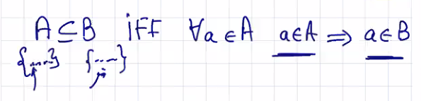
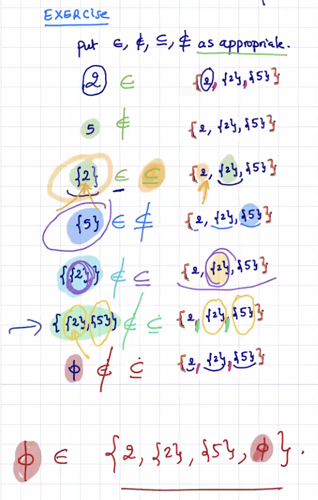
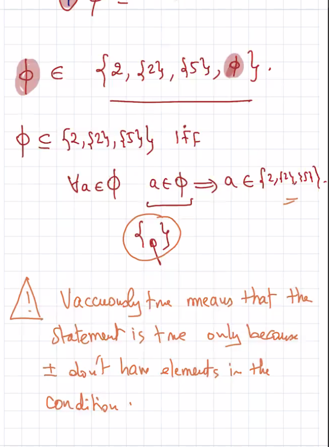
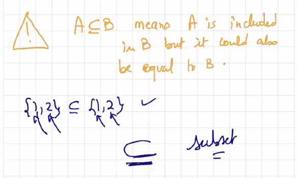
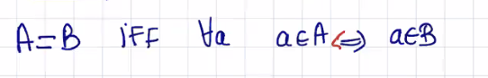
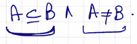
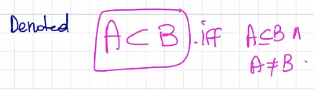
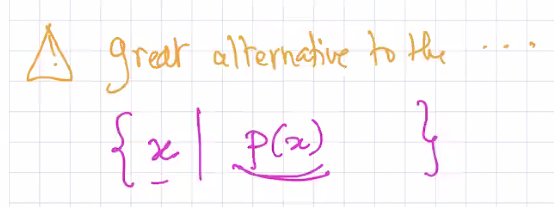
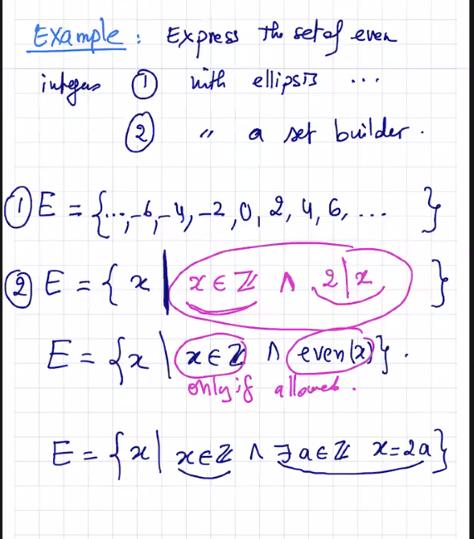

### Lecture 11 at 10:10am on February 17th, 2021

---







---



## Equality between Sets

```
Two sets A,B are equal provided that they have the same elements
```



## Proper Subset

```
A is a proper subset of B provided:
```





## Universal Set

Set containing everything, or every element, under consideration

Russel's Paradox

## Set Builder 

A concise and complete way to define a set using logic

We are provided a way to determine what types of elements are allowed



