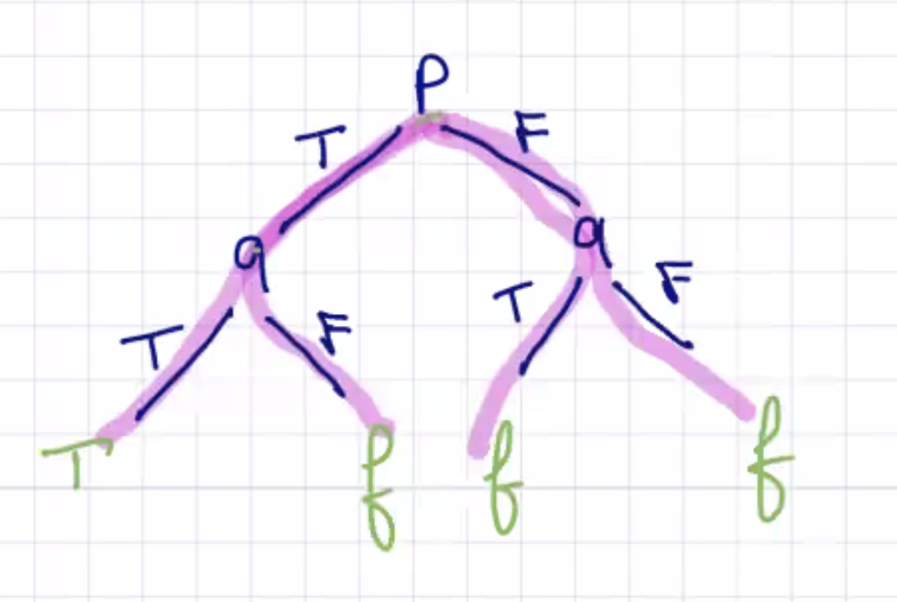
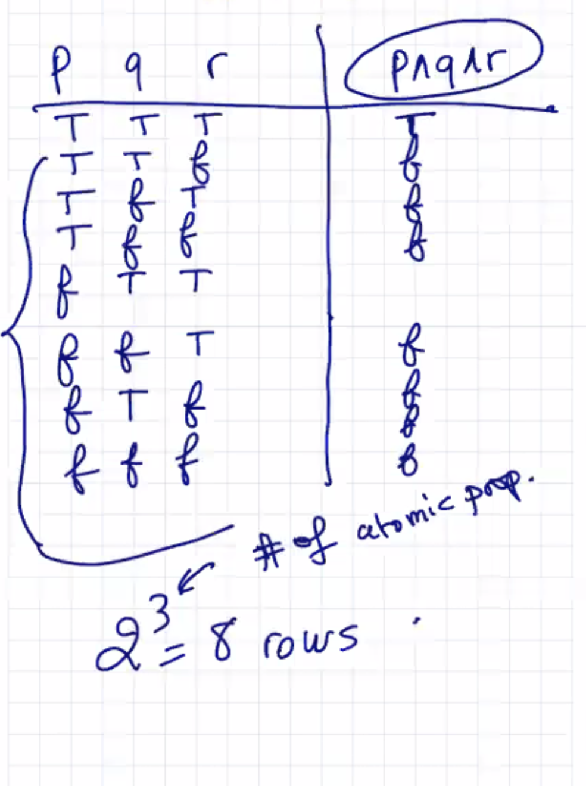
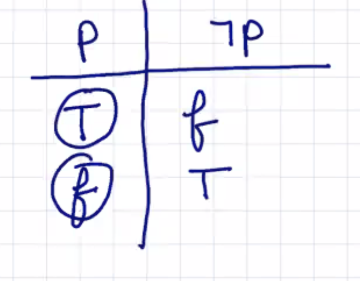

## Lecture 2 at 10:09am

# Logic

- Axioms
- Definitions
- Logic

### Def (even number) (note: 0 is an even number)

- an integer is even provided it is divisible by 2

- let *a* { **Z**    ----  *a* is even provided there exists *q* { **Z** such that

   														```a = 2 * q```

### Def (divisible)

- let *a*,*b* be two integers (*a*,*b* { **Z**)  *b* =/= 0              -- the '{' means 'belongs to'
  - ​	we say that a is divisible by b provided there is a quotient q { **Z** such that a = b * q

### Def (odd number)

- let *a* { **Z**; *a* is called odd provided it is not divisible by 2

- (you must define the variables in the example) 

  - there exists *q* { **Z** such that

    ​							```a = 2 * q + 1```

### Def (prime number)

- let *p* { **Z** and *p* > 1
  - we call *p* a prime provided it has two divisors/factors 1 and itself; **1 is not a prime**

---

### Logic

```
inference; rule of inference; logical

philosophy

truth table

boolean logic
```

**propositional logic**

the relation between objects can be **difficult to achieve with propositional logic**

---

**first order logic | logic of predicates**

if you wanted to say all students are smart, you would have to say

```
for all students x smart(x)
```

### Def (proposition) 

Declarative statement for which we can attach a truth value: True | False

```2 + 2 = 4``` is a proposition because **it has a truth value**

```2 + 2 = 5``` is a proposition because **it has a truth value: false**

```4 is less than 6``` is a proposition because **it has a truth value**

```Hello!``` **is not a proposition; there is no truth value**

```This baby is cute``` **is not a proposition; there is no truth value because it's subjective**

```Aliens exist``` **is a proposition because either they exist or don't exist; truth or  false***

**There is no predicate in a regular proposition**

```x + 2 = 5``` **is a proposition** but it's more specifically **a predicate**

- a **predicate is a proposition that depends on some variable**

---

### Def (predicate)

A predicate is a proposition whose truth value depends on one or more variables

- a predicate is a function, and **specifically a boolean function**

- **Predicate logic** extends (is more powerful than) propositional **logic**

  

```
x + 2 = 5
top(x,y)
loves(x,y)
x+y+z = 5
```

In propositional logic (PL), we don't use variables or predicates. We will see them again **First Order Logic (FOL)**

`n is even` **is a predicate**, depending on *one variable*

- this is a **unary predicate**

`buy(x,y)` **is a predicate** depending on 2 variables

- this is a **binary predicate**

`predicate(x,y,z,...,t)` --- the variables

---

### Def (atomic proposition)

The **simplest form of a proposition** is called **atomic proposition**. We use symbols to denote atomic propositions: *p, q, r, s, t*

- basically **something that can be broken up into two propositions**

### Def (compound proposition)

Proposition constructed from **atomic proposition using connectives**, or sometimes what are called *logical connectives*

### Def (logical connectives)

1. <u>Conjuctive</u>, and, denoted, **∧**

Let *p, q* two propositions *p*∧ *q* expresses *p* AND *q*

Examples:

```
(p ∧ q) ∧ (r ∧ s ∧ t)...

(2 + 2 = 5) ∧ (it's rainy)
```

### Truth Table:

| *p* *q* | *p* ∧ *q* |
| ------- | --------- |
| T T     | T         |
| T f     | f         |
| f T     | f         |
| f f     | f         |






2. <u>Disjunction</u>, **OR** denoted **∨**

- at least one is True

**OR** in natural language is often used as an *exclusive* OR denoted *t*, XOR

**In propositional logic, you are allowed to have two True in an OR (disjunction) statement**

**∧ and ∨** are <u>binary</u> connections (connect two propositions)

(p ∧ q ∧ r) ∧ (q ∧ s)


3. The **negation**, **NOT** denoted `¬`

let *p* be a proposition, ¬p means not *p*

¬(2+2=4)



**The negation ¬ is a unary connective **

---

**¬** p **∧** q **∨**

**EVALUATE THE ABOVE IN A TRUTH TABLE**

