## Lecture 3 at 10:09 am

## More Logic

---

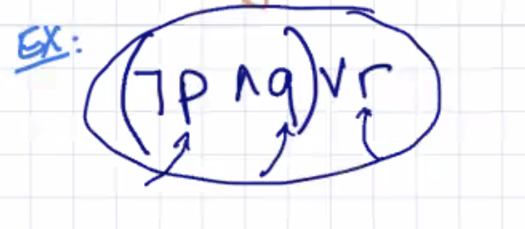

- for **Truth Tables**, list all possible combinations

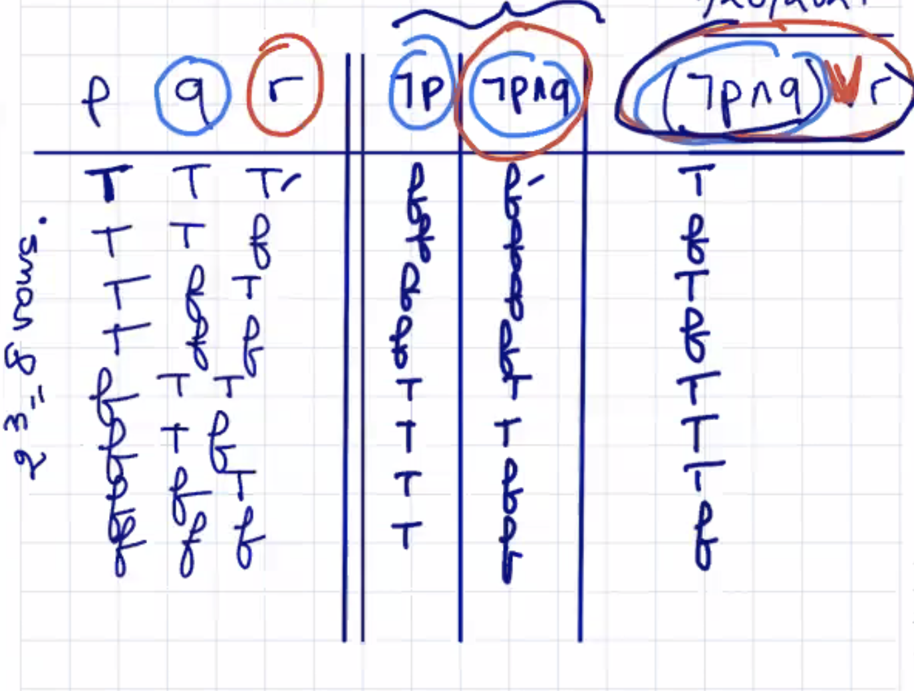

## Implication (If then)

denoted -> or =>

snow -> closed

---

```
p -> q
condition -> conclusion
antecedent -> consequent
```

It is false if the antecedent is **True** but the consequent is **False**

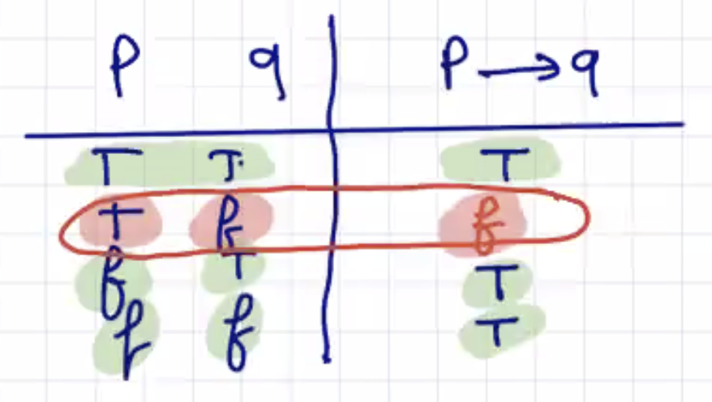

Use the example: **p (I am elected) --> q (I will lower taxes)**

When is the implication false? I might be able to lower cases even without being elected

### Note: TRUE never implies False

---

Another example: **If I hit my thumb with a hammer, then my thumb will hurt**

hit: I hit my thumb

hurt: my thumb hurts

hit --> hurt

### Note: you must look at ALL combinations and go from there

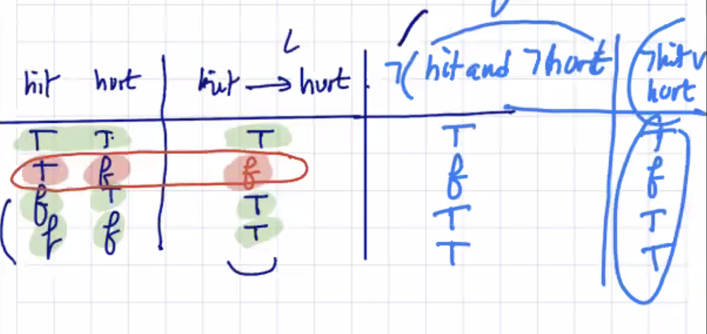

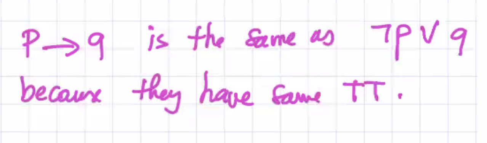

**TT means Truth Table**

---

## Logical Equivalence

Two propositions *p*, *q* are `logically` equivalent provided they have the same truth table

We create only well-formed propositions

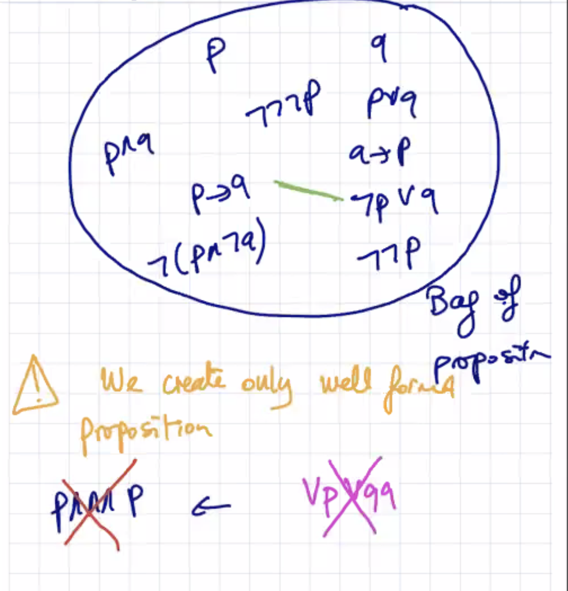

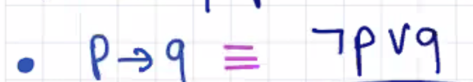

The above image is the sign for **Logically Equivalent**... it is NOT a connective. It is a **relationship** between propositions.

---

### Connective of If and Only If denoted

- iff
- <-->
- <==>
- **p <--> q means (p --> q) ^ (q --> p)**

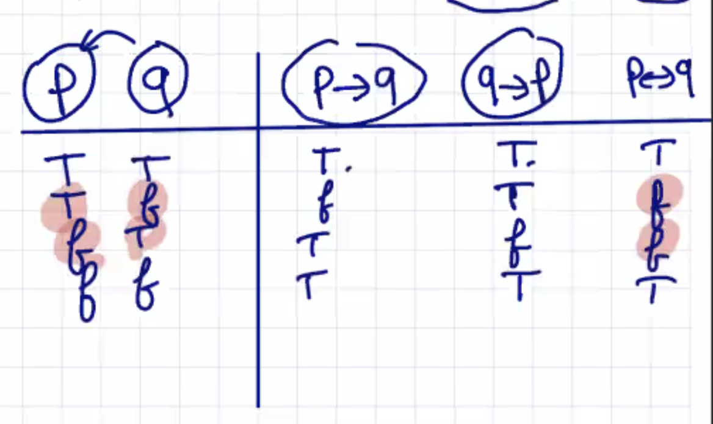

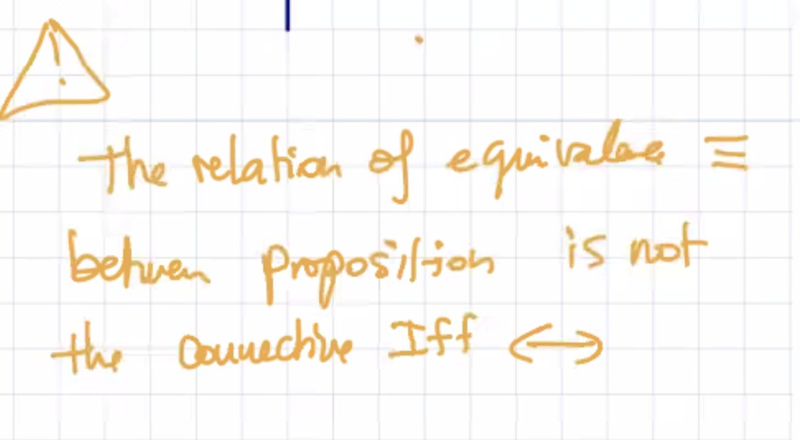

### The relationship between equivalence (three lines thingy) and <-->

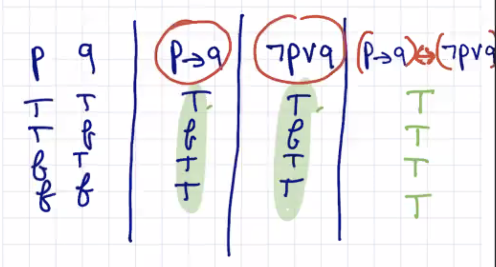

**Tautology** - if you do the iff as a connective, you get a tautology

---

### Def (Tautology)

A proposition is called a tautology provided it is always true

---

hot ^ sunny (logically equivalent) sunny ^ hot

**They have the same Truth Tables**

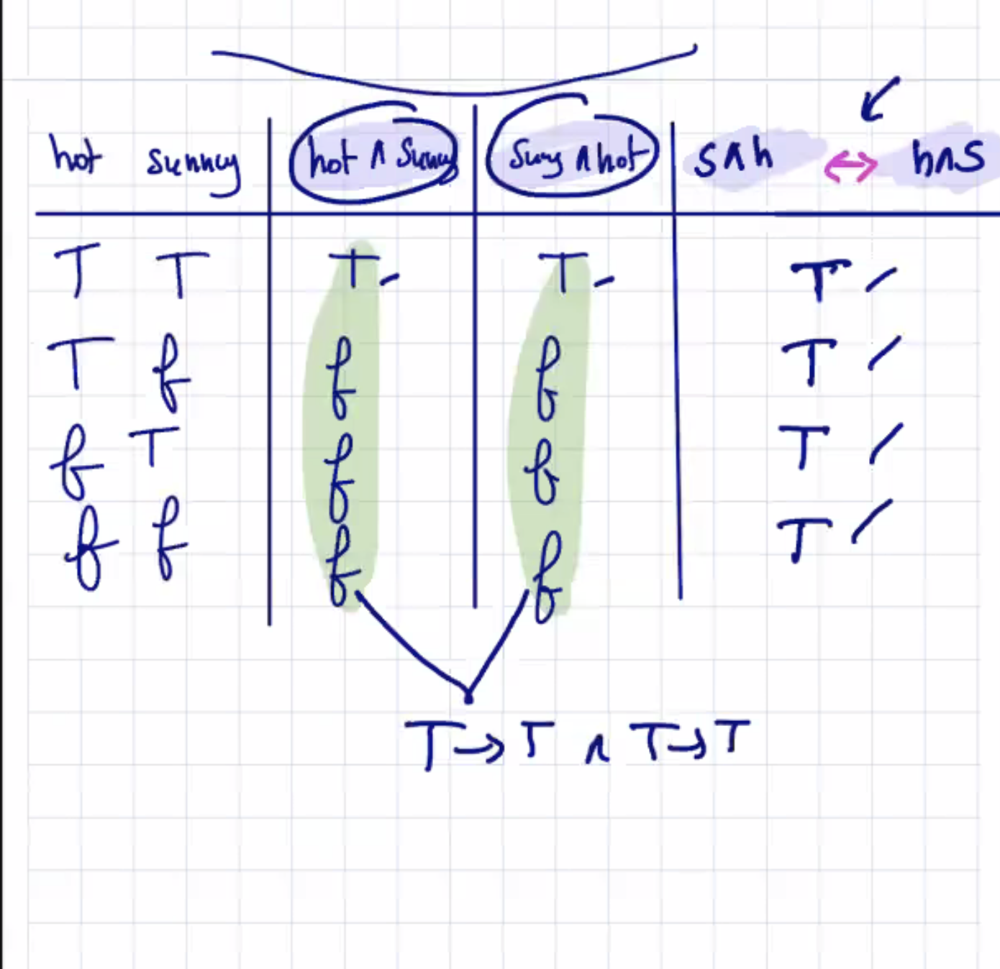

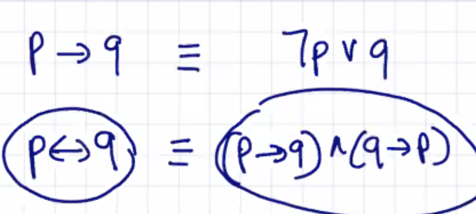

---

### PEMDAS in Math

You also have an order when evaluating these connectives

## Order of Evaluation of Connectives

From Highest to Lowest Priority


Order example (GO LEFT TO RIGHT IF SAME PRIORITY LEVEL, like and and and)

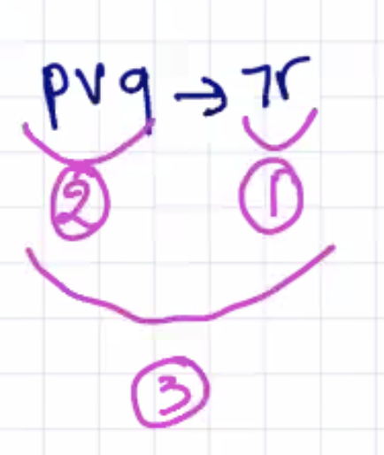

---

## Again Implication

`p --> q ` is an **implication**

`q --> p` is a **converse**	

`not(q) --> not(p)` is a **contrapositive** (an implication is the same as this)

`not(p) --> not(q)` is the **inverse**

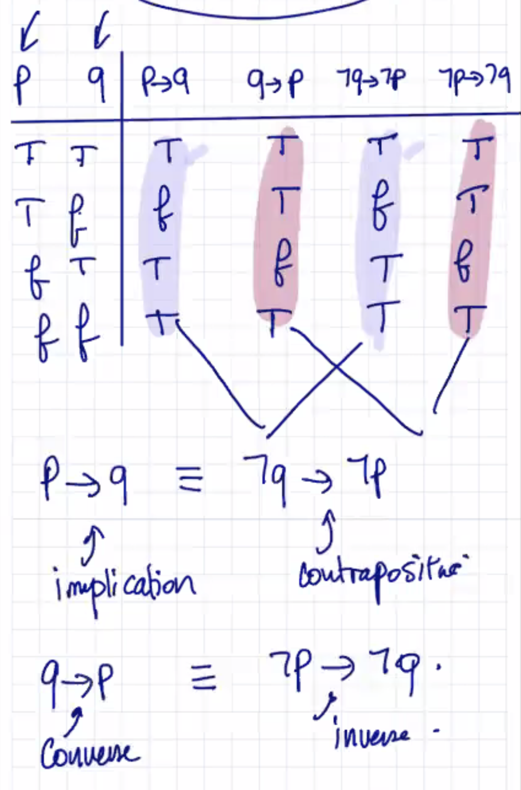


### p --> q LOGICALLY EQUIVALENT not(q) --> not(p)

### hit --> thumb LOGICALLY EQUIVALENT not(thumb) --> not(hit)

---

## Def (Fallacy or Contradiction)

A proposition that is always false is called a **fallacy** or a **contradiction**

**You can't have HOT and not(HOT)**.

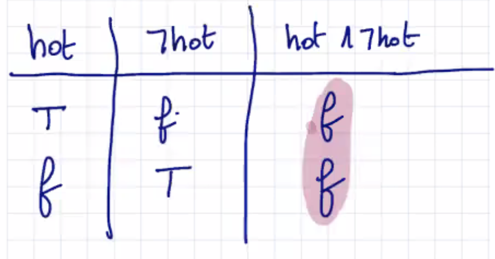

---

All True = proposition is a **Tautology**, All False = proposition is a **Fallacy**

---

## Def (Contingency)

A proposition that is not a **tautology** nor a **fallacy** is called a **contingency**

It's HOT or not(HOT) **is a tautology**


