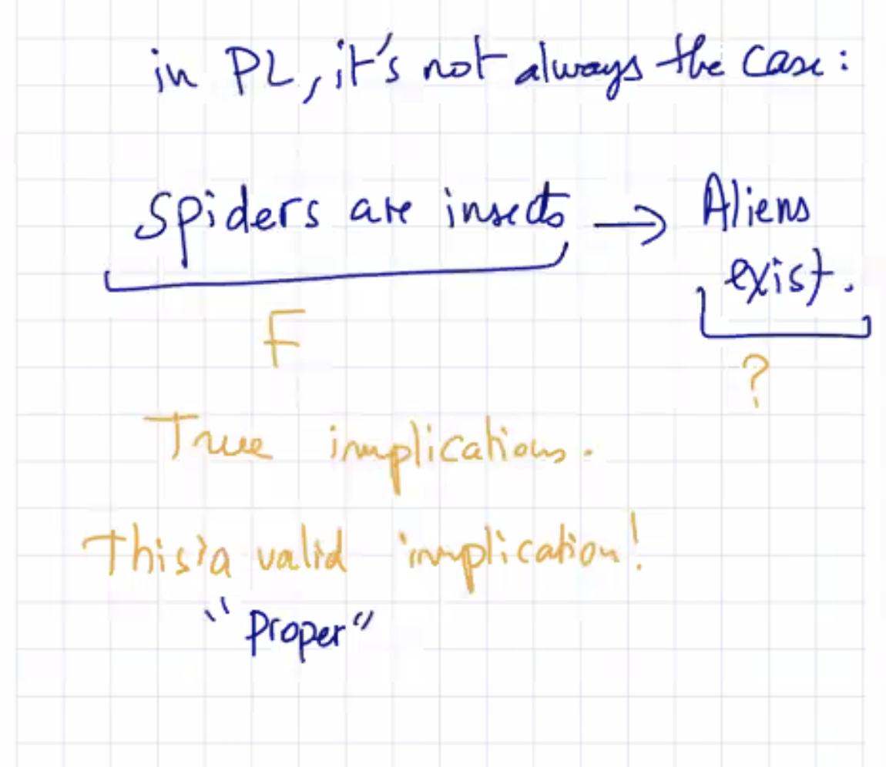
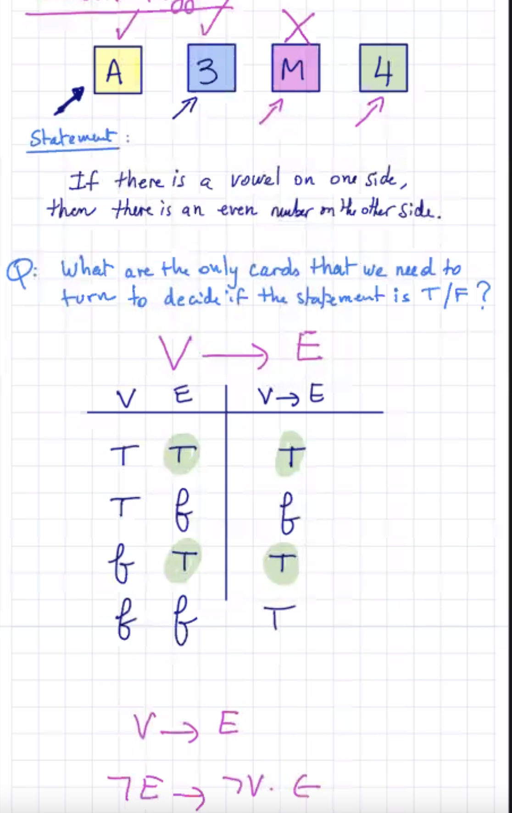
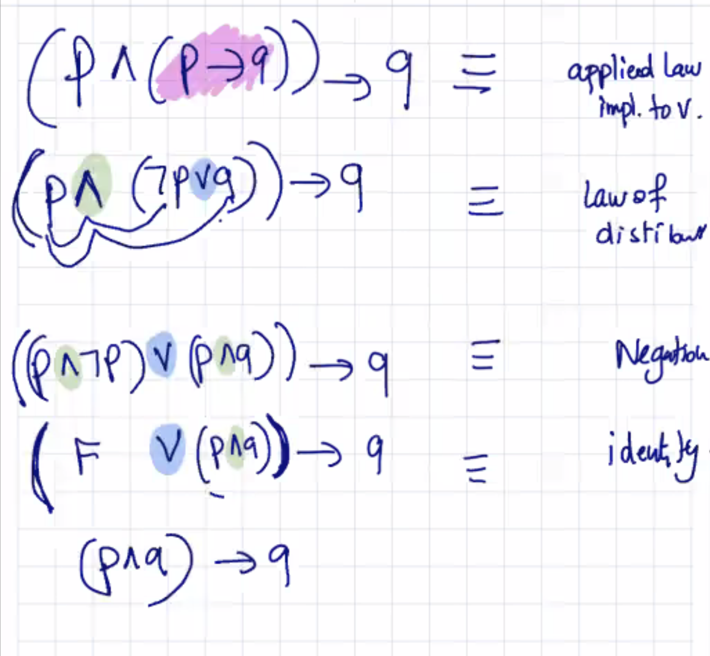
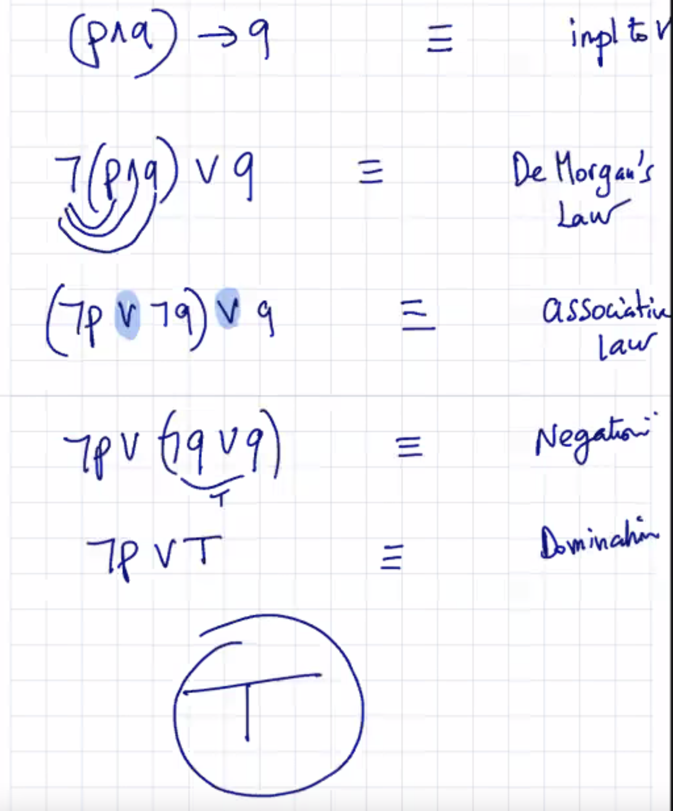

## Lecture 4 at 10:08am on January 25th, 2021

### Review

**Tautology** is always true for all inputs

**Fallacy** or **Contradiction** is always false 

**Contingency** is sometimes True, sometimes False

---

### Causality and Implication



---

## Wason Puzzle



---

## PL Laws/Rules

Great to prove that a proposition is a Tautology

However, sometimes it's too complex to do an entire Truth Table

1. **Identity**
   - *p* AND *True* == *p*
   - *p* or *False* == *p*
2. **Domination**
   - *p* OR *True* == *T*
   - *p* AND *False* == *F*
3. **Idempotence**
   - *p* OR *p* == *p*
   - *p* AND *p* == *p*
4. **Negation**
   - *p* OR not(P) == *T*
   - *p* AND not(*p*) == *F*
5. **Double Negation**
   - not(not(*p*)) == *p*
6. **Communative**
   - *p* AND *q* == *q* AND *p*
   - *p* OR *q* == *q* OR *p*

7. **Associativity**

   **note: the same connectives ONLY**

   - *(p* AND *q*) AND *r* == *p* AND (*q* AND *r*)
   - (*p* OR *q*) OR *r* == *p* OR (*q* OR *r*)
   - (*p* AND *q*) AND (*r* AND *s*) == *p* AND *q* AND *r* AND *s*
   - (*p* OR *q*) OR (*r* OR *s*) == *p* OR *q* OR *r* OR *s*

8. **Distributivity**

   **note: if different connectives, DISTRIBUTE**

   **you can also do it with the same connectives if you want**

   - *p* AND (*q* OR *r*) == (*p* AND *q*) OR (*p* AND *r*)
   - *p* OR (*q* AND *r*) == (*p* OR *q*) AND (*p* OR *r*)
   - *p* AND (*q* AND *r*) == (*p* AND *q*) AND (*p* AND *r*)
   - *p* OR (*q* OR *r*) == (*p* OR *q*) OR (*p* OR *r*)

9. **Absorption**

   **absorbing when you have conjuction and then disjunction or vice versa**

   - *p* OR (*p* AND *q*) == *p*
   - *p* AND (*p* OR *q*) == *p*

10. **De Morgan's Law**

    **conjuction becomes disjunction**

    - not(*p* AND *q*) == not(*p*)OR not(*q*)

11. **Implication to Disjunction**

    - *p* --> *q* == not(*p*) OR *q*

12. **Iff (if and only if) to Implication**

    - *p* <--> *q* == (*p* --> *q*) AND (*q* --> *p*)

---

## Exercises

Prove:

```(p AND (p --> q)) --> q is a Tautology```





