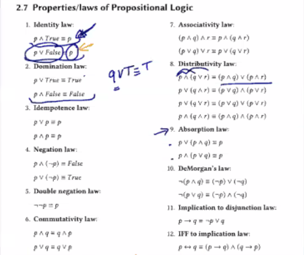
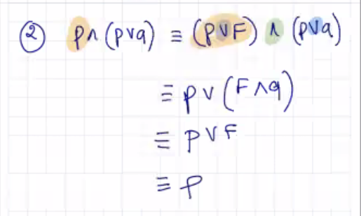
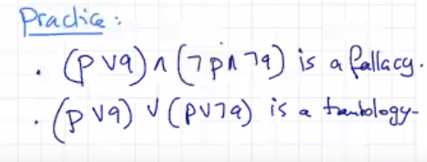
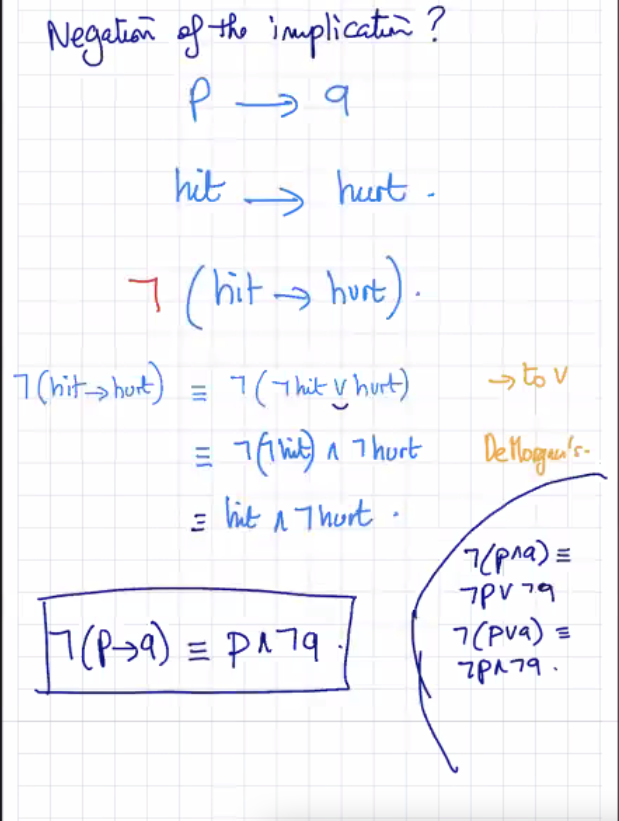

Notes at 10:18am on January 27th, 2021

---

In many situations, you can **undistribute** if you need to go backwards

If you are getting rid of a variable, try to put it with a **True** w/ Disjunction, or **False** with Conjuction

---

---

## Logical Inference

