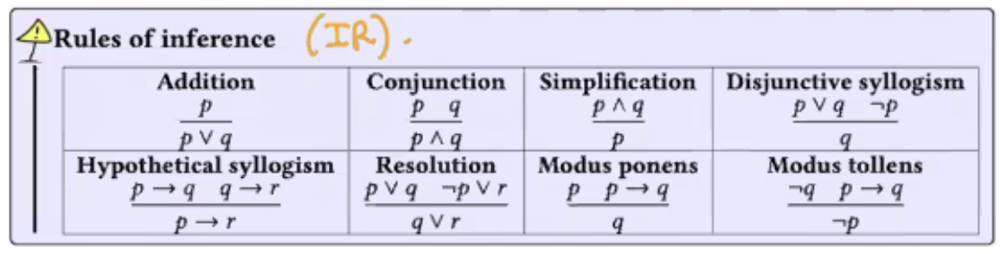
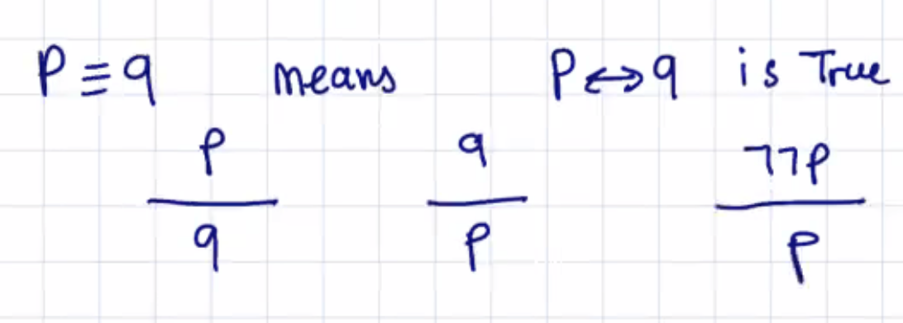
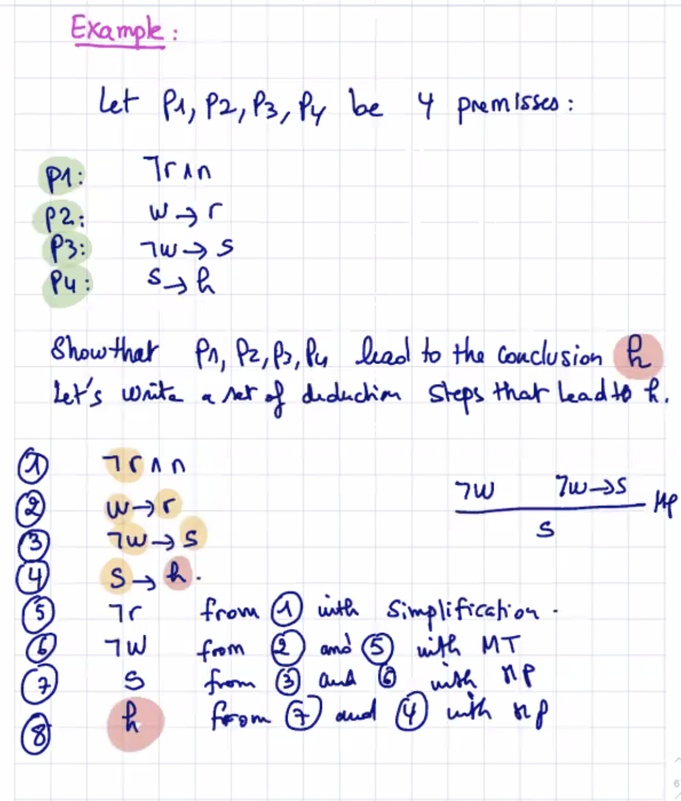
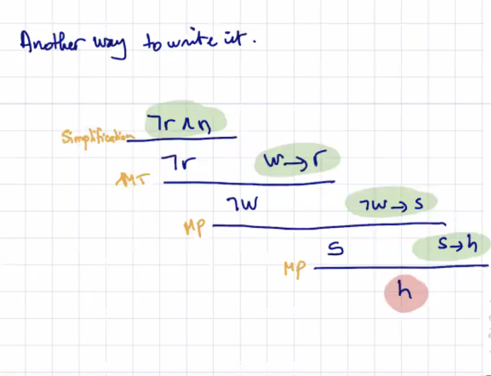
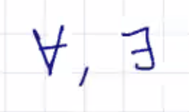
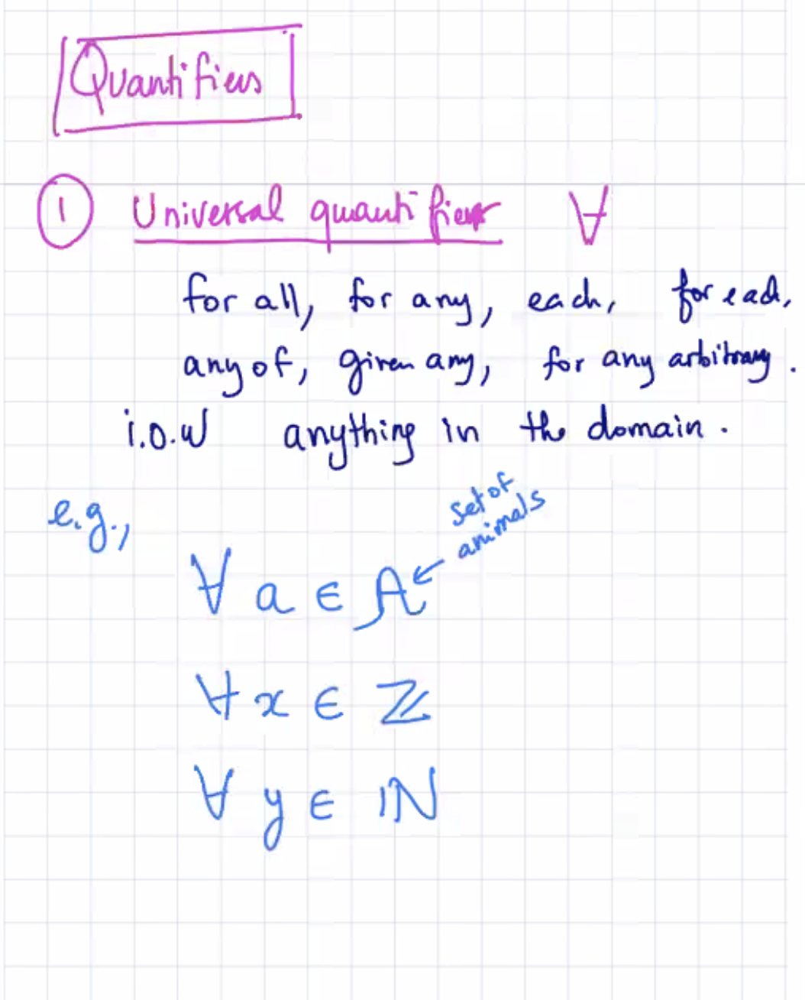
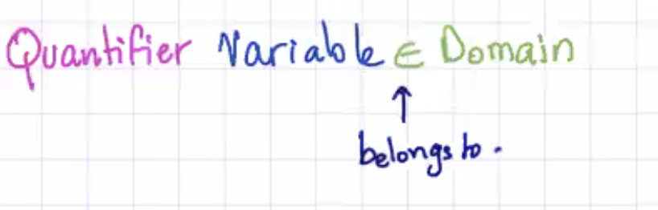
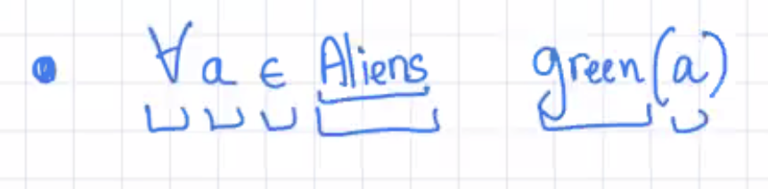
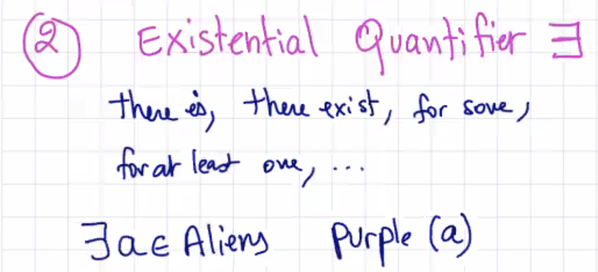
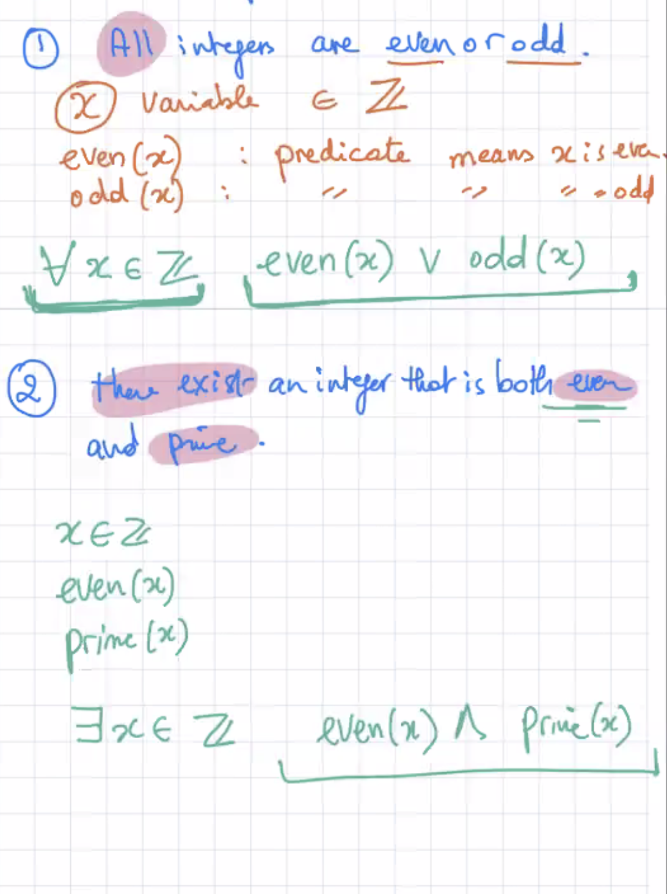

## Lecture 6 at 10:08am on February 1st, 2021

---

Given some premises, if they happen, we can draw conclusions

### Any law in PROPOSITIONAL LOGIC is also an INFERENCE RULE



---

## Examples

 



---

### We don't get rid of anything when we simplify for inference rules; we just add it on since it's another True statement

### The best strategy is to LOCATE your conclusion and go backwards

---

## First Order Logic - "FOL"

**PL is not compact!** We need to invent many many atomic propositions

**PL does not allow to express relationships.** 

Examples:

```
All aliens are green
There is a purple alien
All prime numbers are odd
Some prime numbers are even
Each student in this class took calculus
```

### First Order Logic extends Propositional Logic with:

1. **Quantifiers** - we can express quantity now





2. **Predicates** - a proposition that depends on a variable
   - variables
   - constants

### Use all connectives, rules, ...

Quantifier variables





You can invent predicates as needed



---

## Examples

1. All integers are even or odd
2. There exists an integer that is both even nd prime

