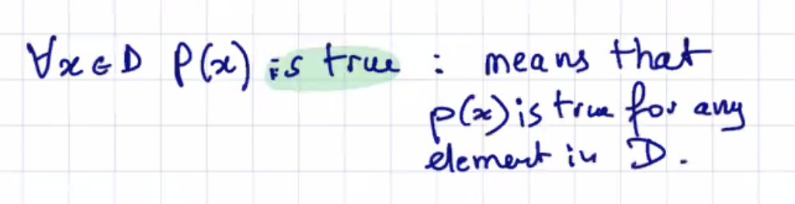
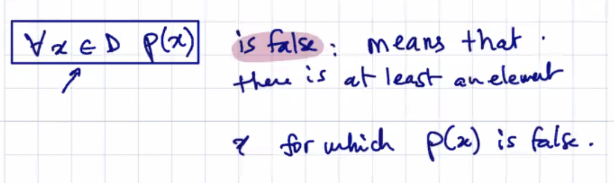
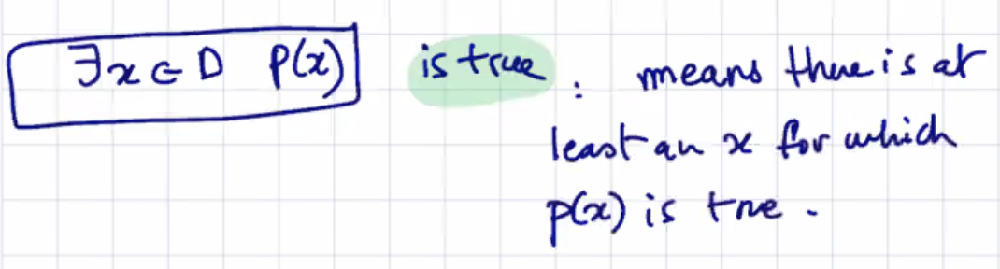
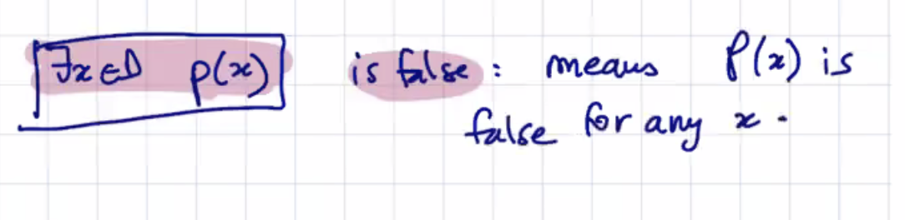
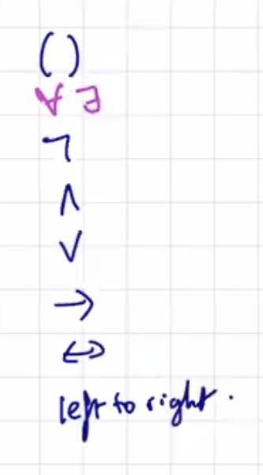
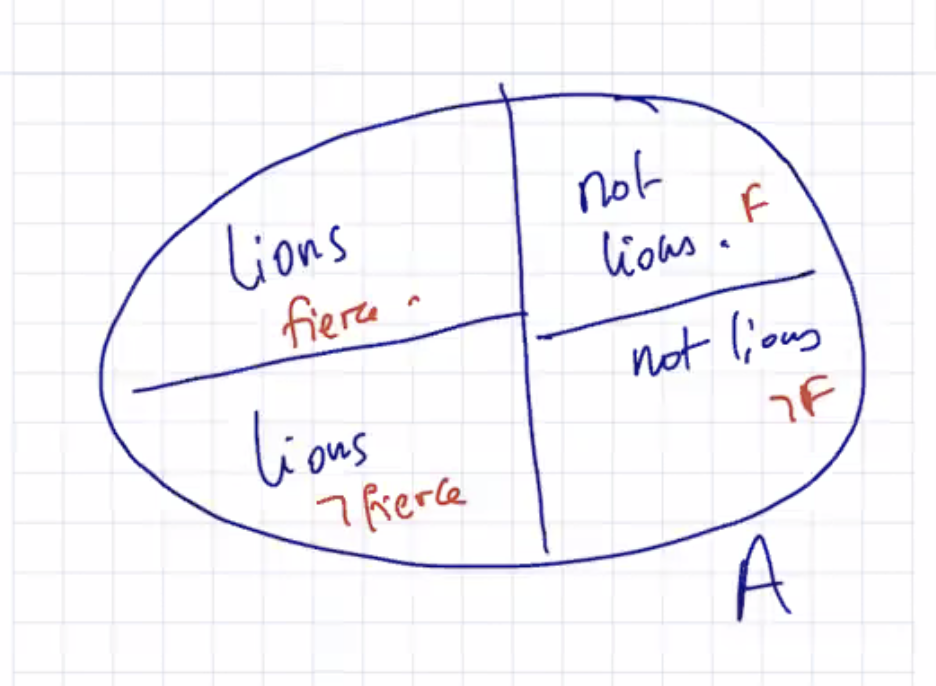
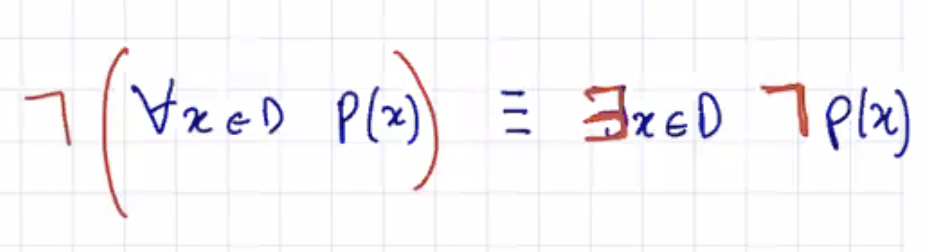
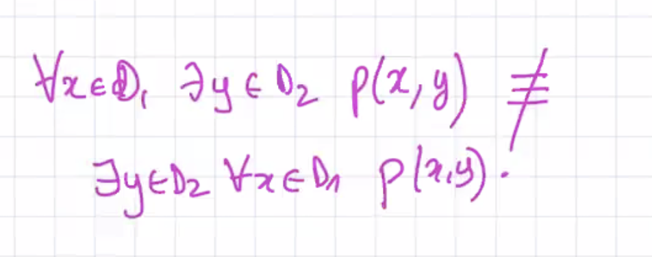

## Lecture 7 at 10:09am on February 3rd, 2021

---

## FOL (continued)

- you use **quantifiers**
- you can invent variables and predicates

## FOL Propositions and Truth Value

---

## Order of connectives and quantifiers in FOL

## 

---

## Domain in FOL

**Defining the domain is crucial in writing FOL sentences**

### Most of the time, if you have a (ALL, it goes with implication); if you have a (SOME, it goes with and)

---

## Negation of FOL:

---

### We can mix quantifiers if we want to

**ORDER MATTERS**; you can only swap quantifiers only if they are the same

