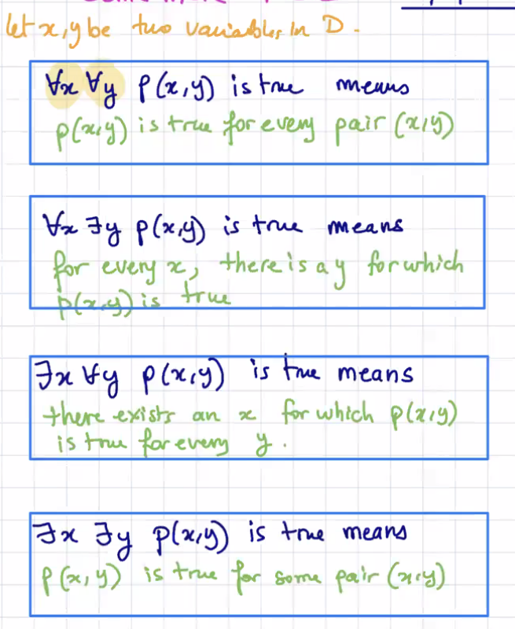
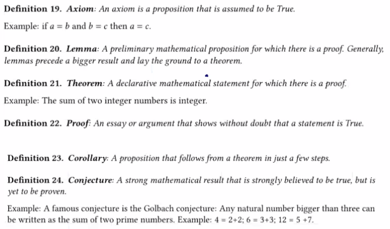
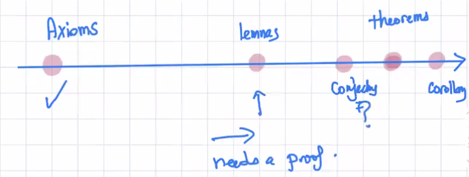
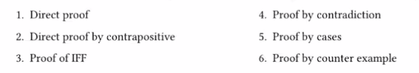
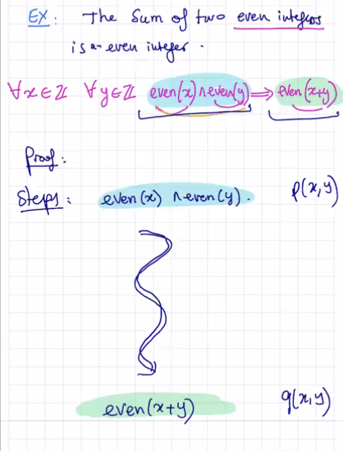

10:12am on February 8th, 2021

---

## More FOL

When the domain is clear, it's ok to omit it after the variable(s)

## Definitions

### Theorem

a **big** result that has been proven by someone

---

## Proof

An essay or argument that clearly shows that a statement is True

---

### Lemma

a **small** theorem

---

### Axiom

Something that is **so basic that it doesn't need a proof; it's assumed to be True**

---

### Corollary

 a **small** result that follows from a theorem; it's a **consequence from a theorem**

---

### Conjecture

**believed to be True but there is no proof for it**

---

---

### Kinds of Proofs

Plus **Proof by enumeration (exhaustive proof)** (maybe the domain is very strict and not large)

- simply verify p(x) is True for every single value

---

## Direct Proofs

1. Write the first sentence of proof *p(x)* (if needed, invent variables)
2.  Write the last sentence of the proof 

