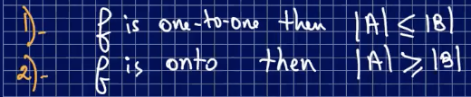

### Miscellaneous Notes on Functions

- if |A| > |B|, it **can't be one-to-one** because two a in A must go to the same image
- if |A| < |B|, it **can't be onto** because there exists b in B where it does not have a preimage

---

---

- for there to be a function, you **cannot have an element in the domain mapping to more than one element in the codomain**

