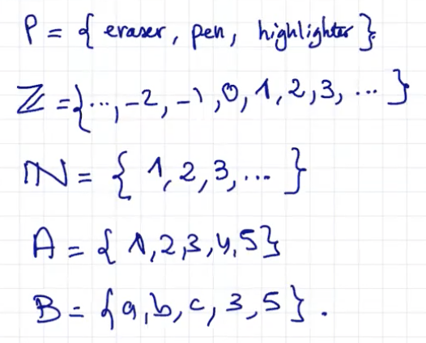
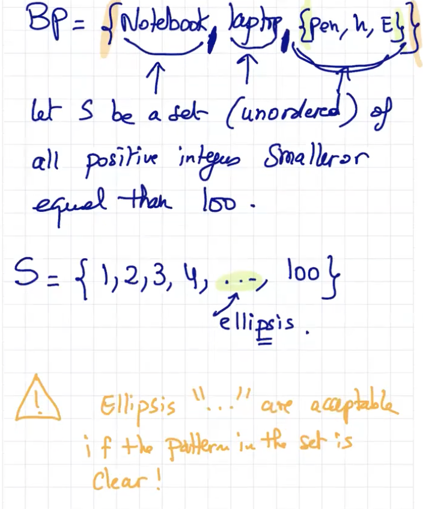
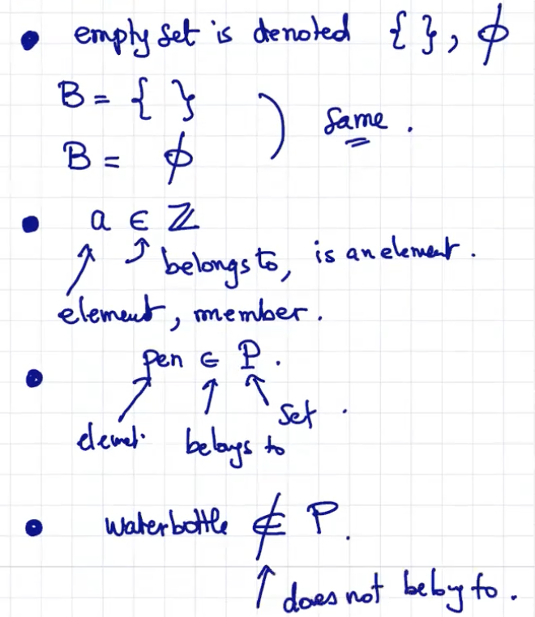
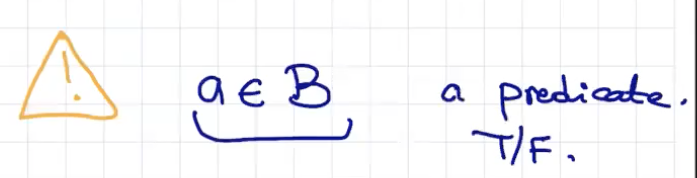
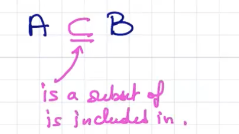
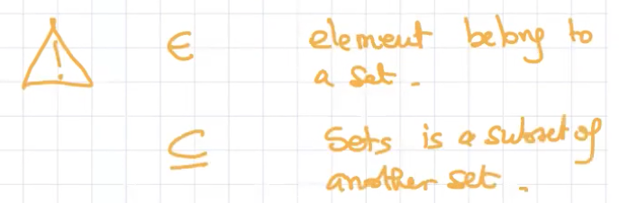
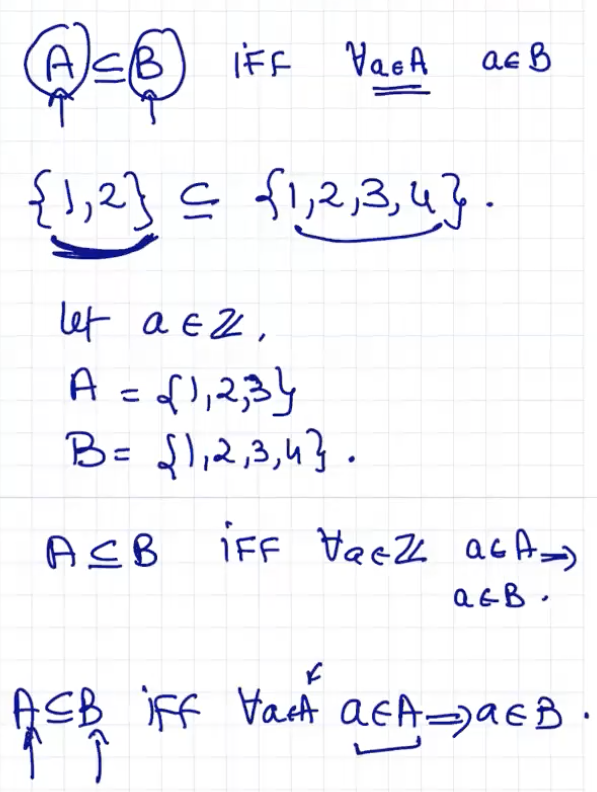
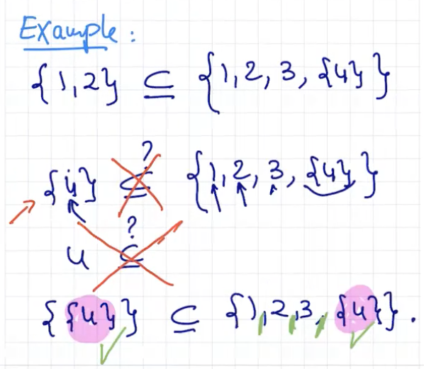

### Lecture 10 at 8:45am on February 17th, 2021

---

### Proof by Enumeration

You're being very specific

### Proof by Cases

You're being very general

---

## Sets

**2 types of sets**:

1. **Underordered sets**

- Collection of elements
- Order does not matter
- **set**

2. **Ordered Sets**

- order matters (SSN, License Plate)
- **Lists**

### What is a set?

It's a collection of distinct objects

You can even have sets inside sets





---

### Empty Sets





---

### Subsets

```
Let A,B be two sets. A is a subset of B provided every element of A is also an element of B. 

```









