### Lecture 11 at 10:10am on February 17th, 2021

---

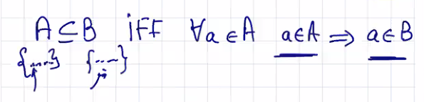

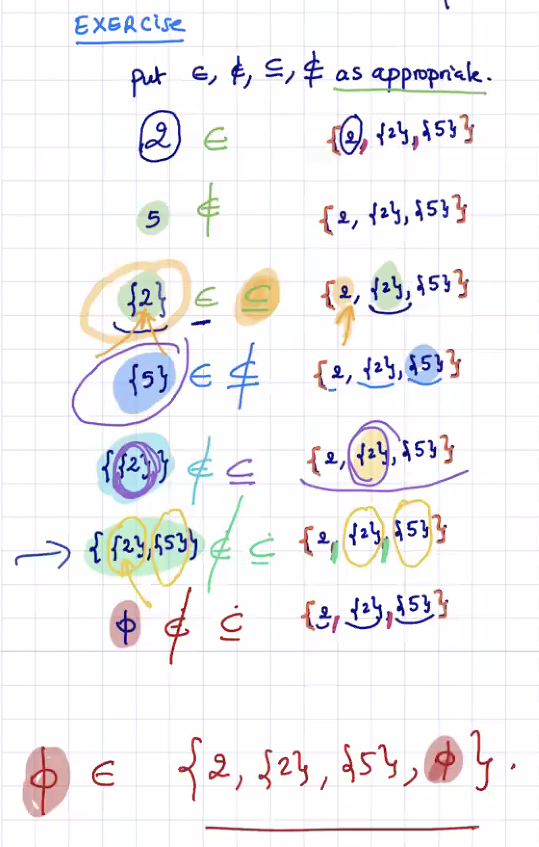

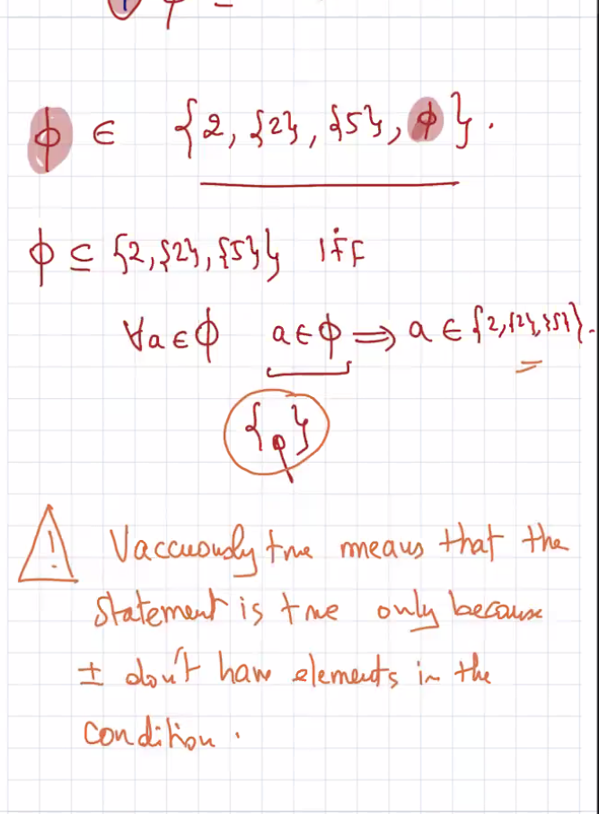

---

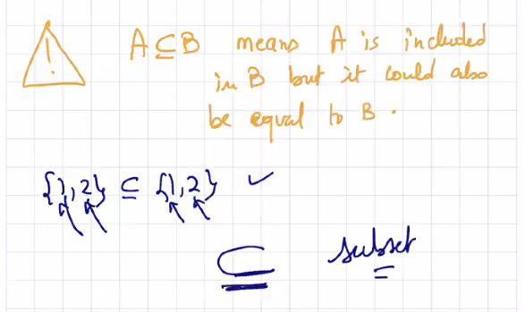

## Equality between Sets

```
Two sets A,B are equal provided that they have the same elements
```

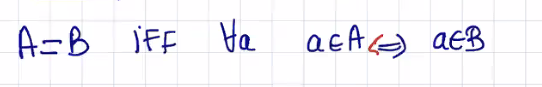

## Proper Subset

```
A is a proper subset of B provided:
```

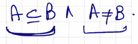

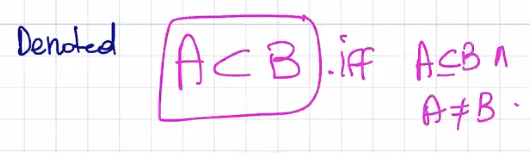

## Universal Set

Set containing everything, or every element, under consideration

Russel's Paradox

## Set Builder 

A concise and complete way to define a set using logic

We are provided a way to determine what types of elements are allowed

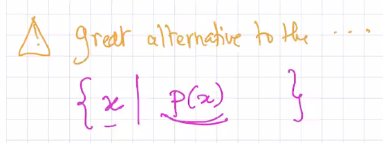

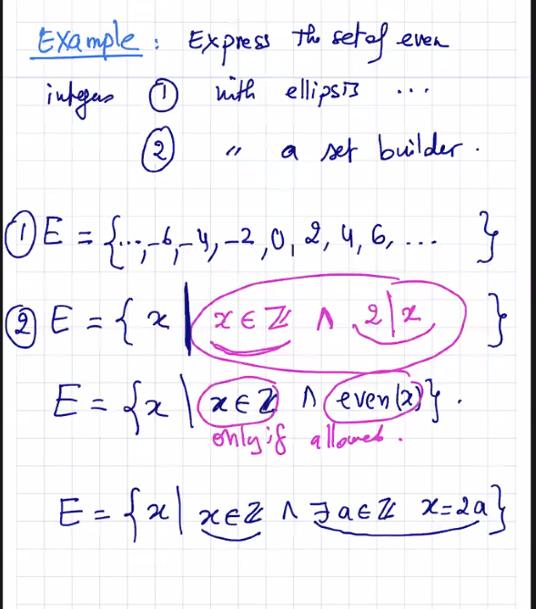

---

### Practice with Set Builders

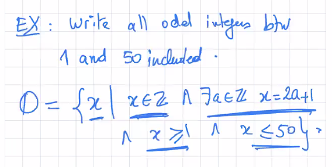

You can omit saying that **x is an integer**, but it's ok if you have it.

---

## Powersets

**The empty set is ALWAYS a subset of a powerset**

```
the set of all subsets of a set A is called a Powerset:
```

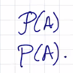

```
P(a) is a set of subsets
```


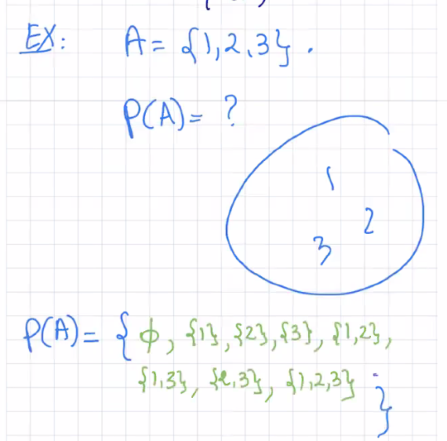

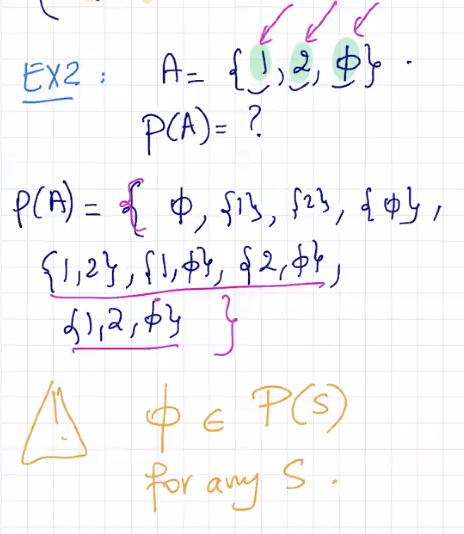

---

### Cartesian Product A x B

```
The Cartesian product of two sets A,B is the set of ordered pairs (a,b) such that
```

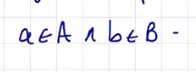

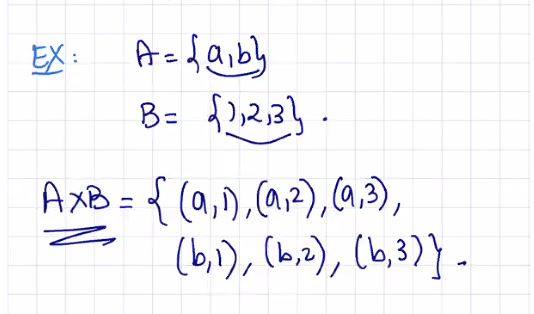

### Operations

**Union**: just putting the elements together in the same bag

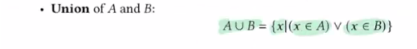

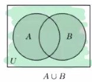

---

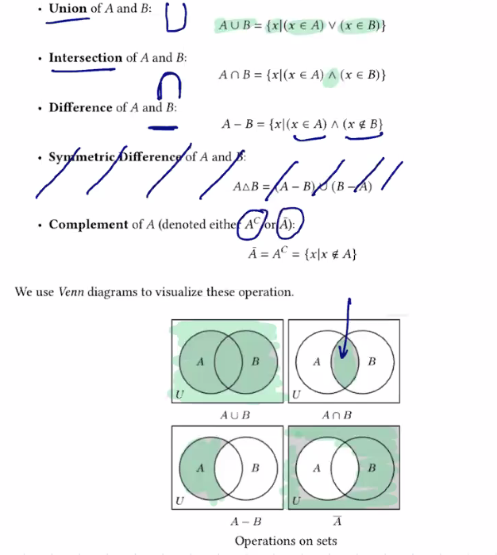

