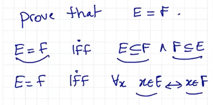
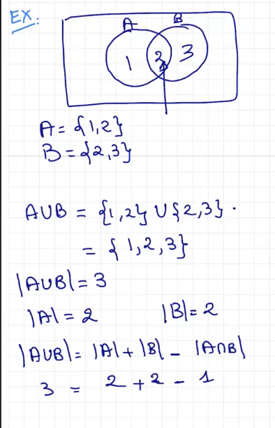
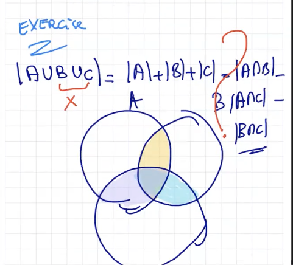

## Lecture 12 at 1:08pm on February 22nd, 2021

---


---

## Proofs

```
Prove the associativity property for U between sets using set builders and logic
```


---

## Def (finite)

```
A set is called finite provided it has exactly n distinct elements otherwise it is called infinite
```


---

## Def (cadinality) 

```
The number of distinct elements is a finite set A is called its cardinality denoted |A|
```


## Theorem:

```
Let A be a finite set the cardinality of the power set of A is 2^|A|
```


---

## Proof Technique

 


---

## Example




---

## Proposition

```
Let A,B be two finite sets

|A U B| = |A| + |B| - |A n B|
The size of the union
```

 

 

If A, B do not share elements (**disjoint**), then **you will have**

```
|A U B| = |A| + |B|
```

but if they do share elements, you have to account for that by doing:

```
|A U B| = |A| + |B| - |A int. B|
```

