### Lecture 13 (first class after spring break) at 2:07pm on March 8th, 2021

---

## Def (List):

a list is an **ordered sequence** of objects or elements

```
(element1, element2, element3, element4)
(6,4,6,3,2,4,3,4,2,1) // like a phone number; order matters!
```

---

### Cartesian Product

```
Let A,B be two sets
A x B = { }

A = {Egem, Ben , Grace, Venkat, Yoni}
B = {Discrete_Math, AI, ML}

A x B = {(Egem, Discrete_Math), (Egem, AI), (Egem, ML),
				 (Ben, Discrete_Math), (Ben, AI), (Ben, ML),
				 (Grace, Discrete_Math), (Grace, AI), (Grace, ML),
				 (Venkat, Discrete_Math), (Venkat, AI), (Venkat, ML),
				 (Yoni, Discrete_Math), (Yoni, AI), (Yoni, ML),}
```

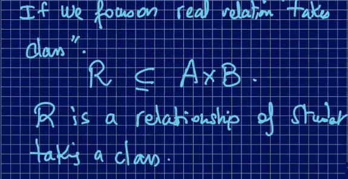

## Def (relation):

Let A,B be two sets. We say that **R** is a relation from A to B provided 

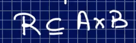

A **relation** is a set of pairs

A **relation** between two sets is a collection of ordered pairs containing one object from each set. If the object x is from the first set and the object y is from the second set, then the objects are said to be related if the ordered pair (x,y) is in the **relation**. A function is a type of **relation**.

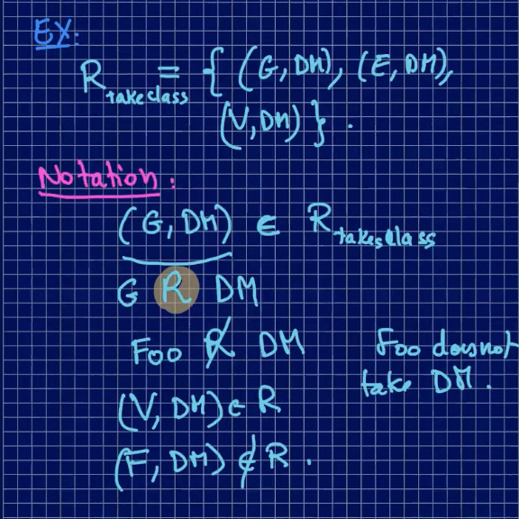

---

Let **R** be a relation on

```
A = {1,2,3,4,5}
```

**R** is a relation from **A** to **A**

x **R** y iff x + y is even **(i.e. if there is a connection, x + y is even; if  x + y is even, there is a connection**

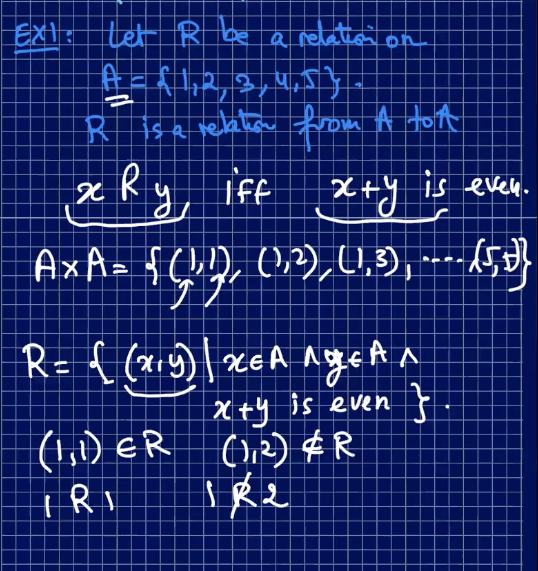

1 and 2 are **not** connected **because their sum is not even**

---

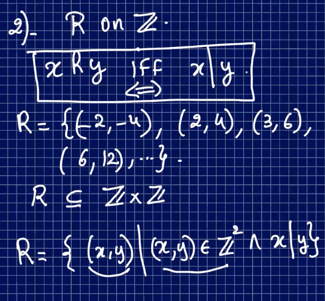

### Def (inverse relation)

Let **R** be a relation from A to B. The inverse relation of **R** is noted **R^-1**

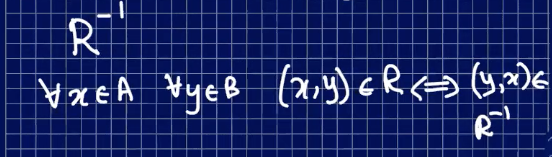

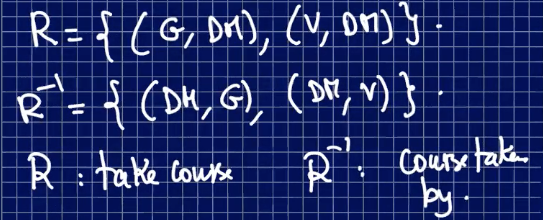

**R** is a relation from A to B

**R^-1** is B to A (flip the order of the pair)


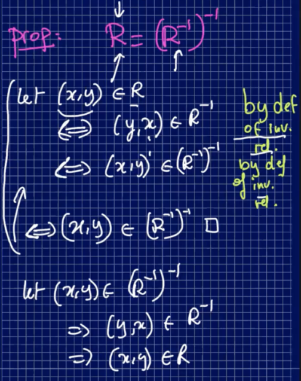

---

## Representation of Relations

### Def (Digraph):

A **directed graph where the nodes (vertices)** are connected by directed edges

Ex.

2 | 4, 4 | 8

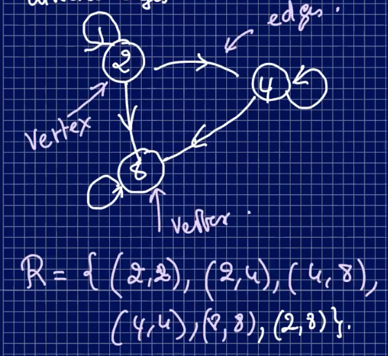

---

### Def (Matrix):

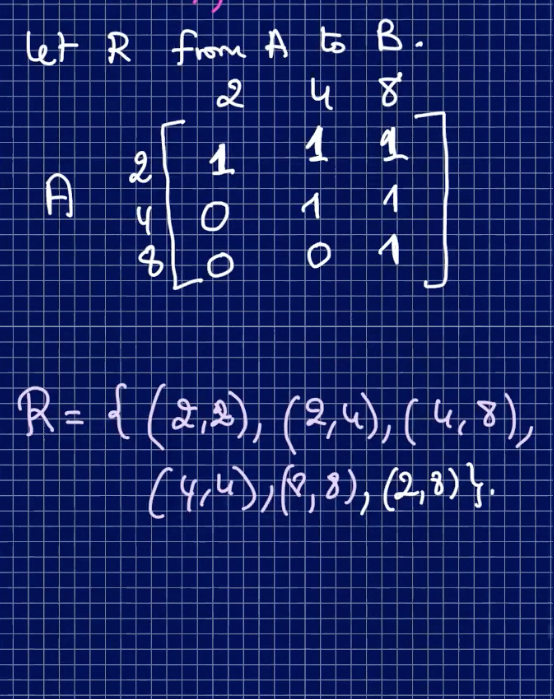

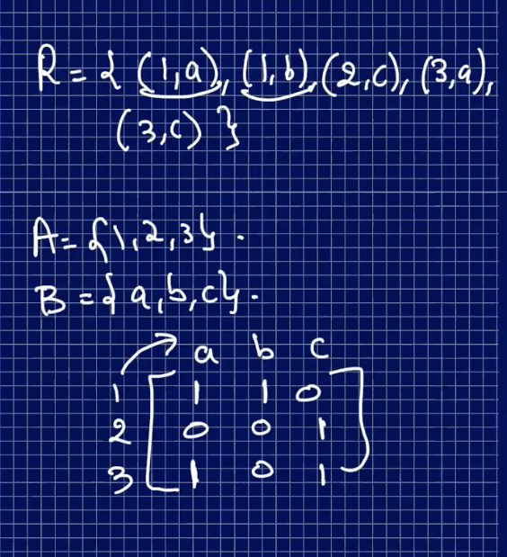

---

### Def (reflexivity):

Let **R** be a relationship on the set A:

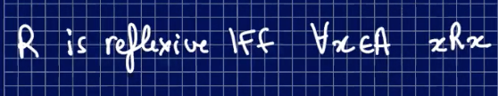

### Def (not Reflexive):

**R** is not reflexive if:

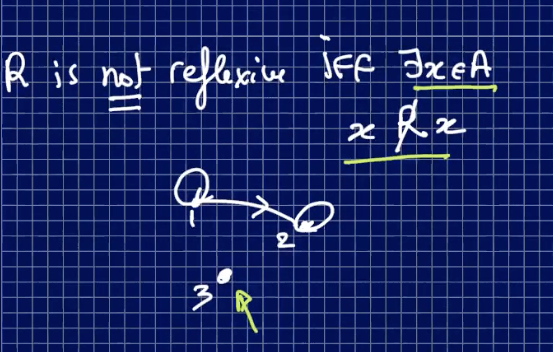

### Def (irreflexive):

**R** is irreflexive:

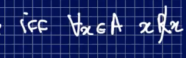

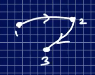

---

### Ex.

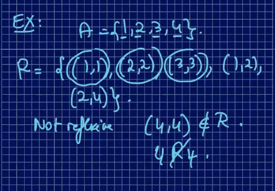

---

### Def (Symmetry):

R is symmetric:

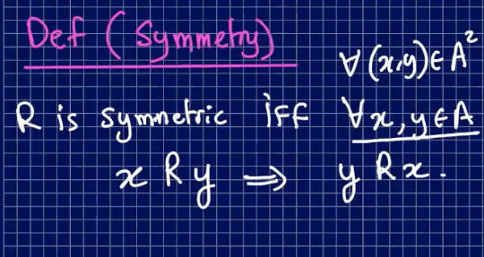

### Def (not Symmetric):

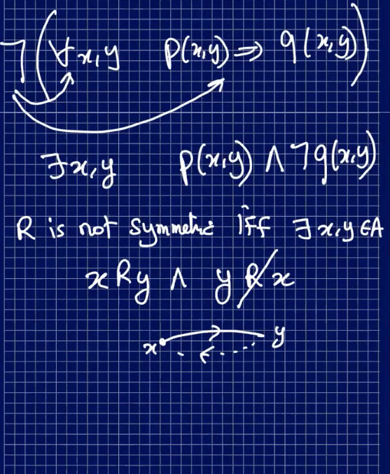

---

Ex.

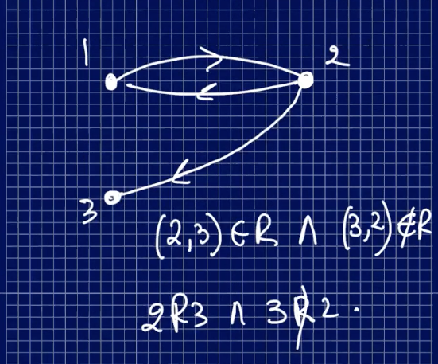

---

### Def (antisymmetric):

**R is antisymmetric** if:

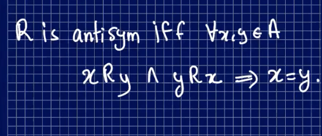