### Lecture 14 at 3:49pm on March 10th, 2021

---

### Antisymmetric

If there's an arrow going in one direction and it doesn't go back, it's antisymmetric

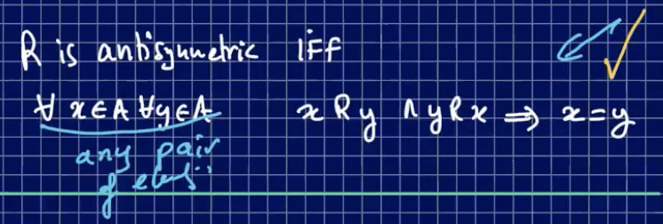

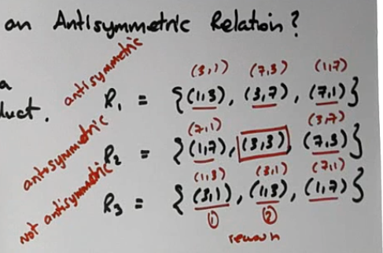

---

### Def (transivitity):

**R is transitive iff**

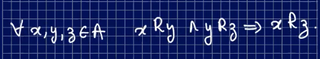

---

**Examples**

**It is reflexive if there is a loop around every element**

**It is symmetric if you have recipricols**

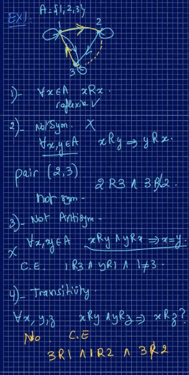

---

**Don't just look at the pairs you have**

The left hand side of this will never be True

**If there are no connections between elements, then it will be symmetric**

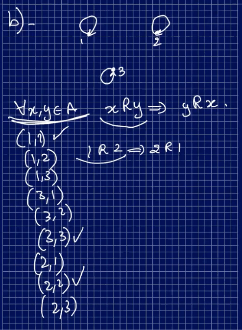

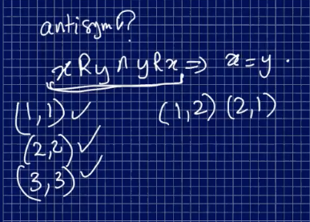

This is also **transitive**

---

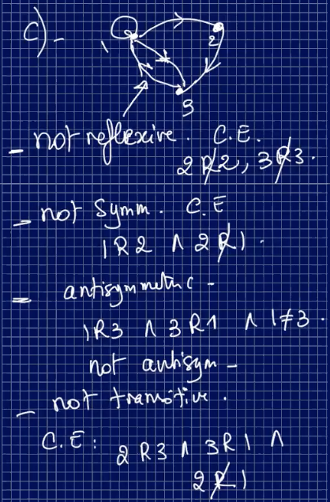

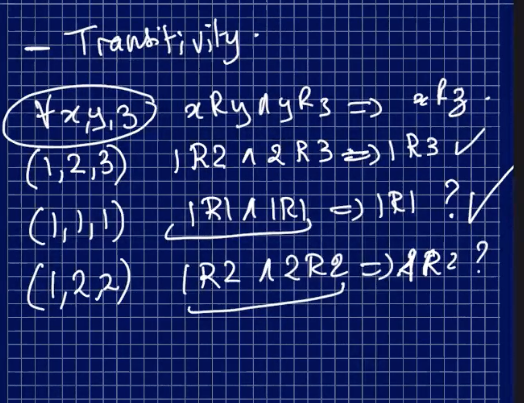

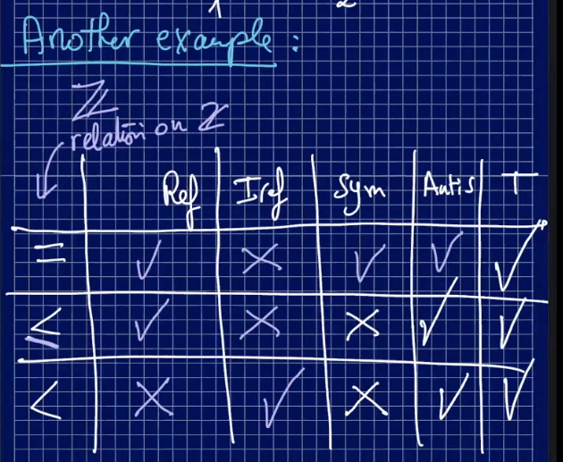

---

### Def (equivalence relation):

Let **R** be a relation on A

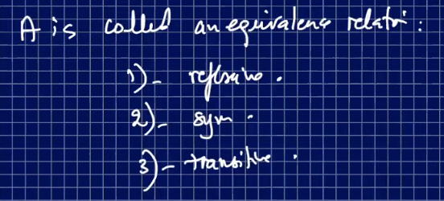

---

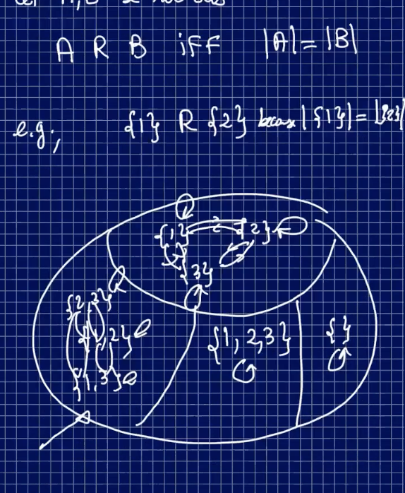

---

### Def (equivalence classes): 

Let **R be an equivalence relation (symmetric, reflexive, etc.)** on **A**

All the elements related to one of the elements (students sitting in the same row)

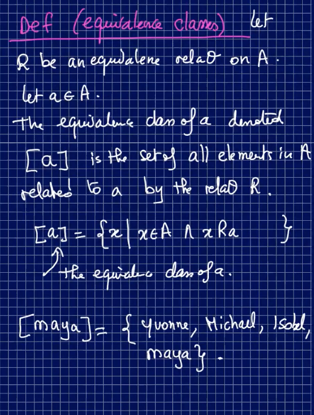

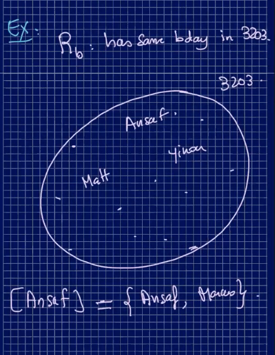

---

### Properties

Let **R** be a relation on A:

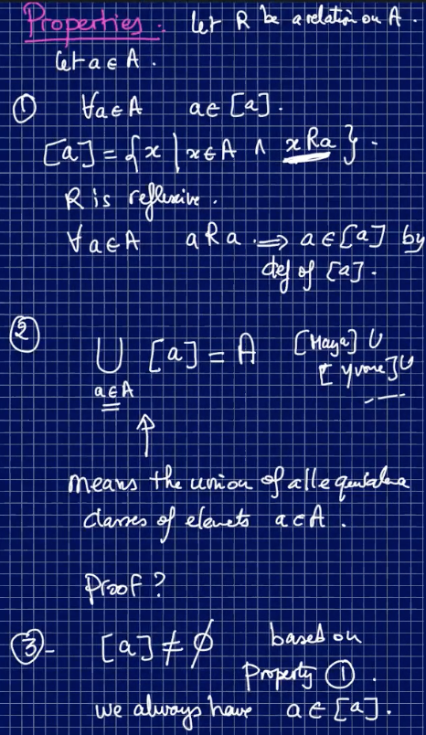

