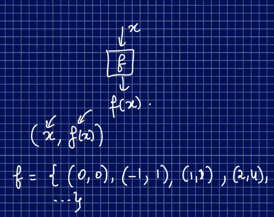
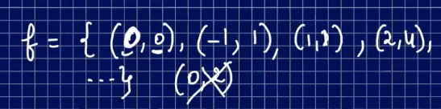
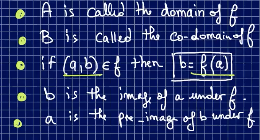
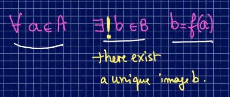
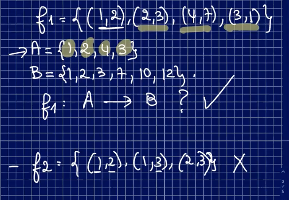
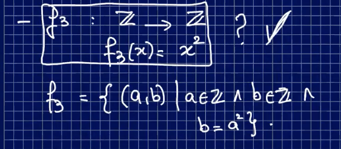

### Lecture 15 on March 17th, 2021 at 1:24pm

---

## Functions

You input **x** into **f**, and you get **f(x)**. 

A Discrete Function is a **binary relation**



### Def (function):

```
Let A,B be two sets of a function f from A to B denoted:
f: A --> B
is a relation on AxB where each element of A appears exactly once as a first element of the ordered pairs

It's a set of ordered pairs
```



### Notation

```
A is called the domain of A
B is called the co-domain of f
```



---

### In FOL, a function is defined as this:



There exists **exactly one** 

---

### Is it a function?





---

## Domain, Co-domain, and Image

```
Let f: A --> B
The set of all second elements of f is called the image of f.
```


Resume at 25:50