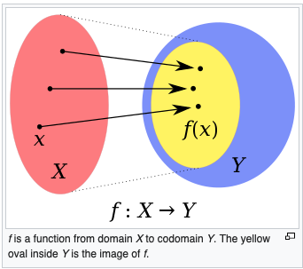

### Lecture 15 on March 17th, 2021 at 1:24pm

---

## Functions

You input **x** into **f**, and you get **f(x)**. 

A Discrete Function is a **binary relation**


### Def (function):

```
Let A,B be two sets of a function f from A to B denoted:
f: A --> B
is a relation on AxB where each element of A appears exactly once as a first element of the ordered pairs

It's a set of ordered pairs
```


### Notation

```
A is called the domain of A
B is called the co-domain of f
```


---

### In FOL, a function is defined as this:


There exists **exactly one** 

---

### Is it a function?


---

## Domain, Co-domain, and Image

```
Let f: A --> B
The set of all second elements of f is called the image of f.
```




**Image is only what you can attain from f**

---

## Representation of Functions

### Bipartite Graphs


---


---

A function gives **a unique value** out

 ## Properties of Functions

1. **Onto Function:** Surjection, surjective function

   No elements from co-domain are **by themselves**


Some elements **in B** don't have an origin 

- **B == image of F**

---

2. **One-to-one Function:** Injection, injective function

   No elements have two or more outcomes


---

## Proofs


---


If you have **both properties** I.e. is both **onto and one-to-one**, this is a **bijection**

---

## Proof Examples

To prove **onto**, you want to show how every element in B maps back an element in A. 

You should solve for a, and plug it back into **f(a)** and show how it's equal to **b**.


---


**The above function is not onto because think of b = 3, there is no preimage**

---

## Def (Bijection):

Let **f: A --> B**

f is a bijection iff

1. **f is onto**
2. **f is one-to-one**

The cardinality is the same: |A| = |B|

If |A| > |B|, f **is not one-to-one**

If |A| < |B|, f **is not onto**

---

