### Lecture 16 at 8:17pm on March 18th, 2021

---

## Onto 

You will never have elements that aren't coming from anywhere (every element in co-domain has a preimage)

## One-to-one

You don't have the same image for two different elements

---

**If there are more elements in A than B,** elements in domain must share images in B

**If there are more elements in B than A,** the function **cannot be onto**

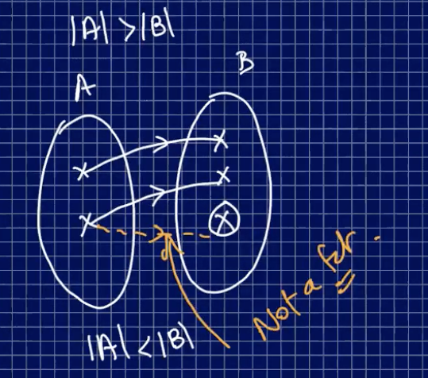

---

**1. f is one-to-one, then |A| is less than or equal to |B|**

**2. f is onto, then |A| is greater than or equal to |B|**

**f is a bijection if the it is one-to-one AND onto**

---

### Examples

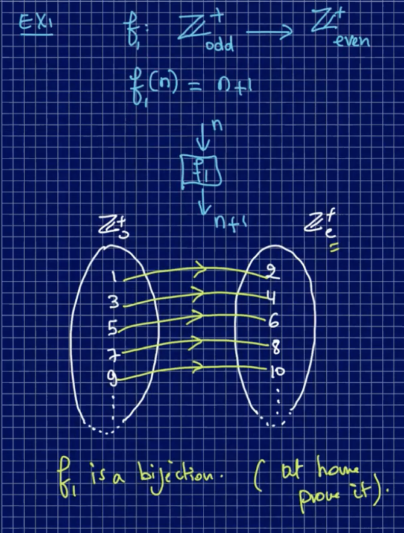

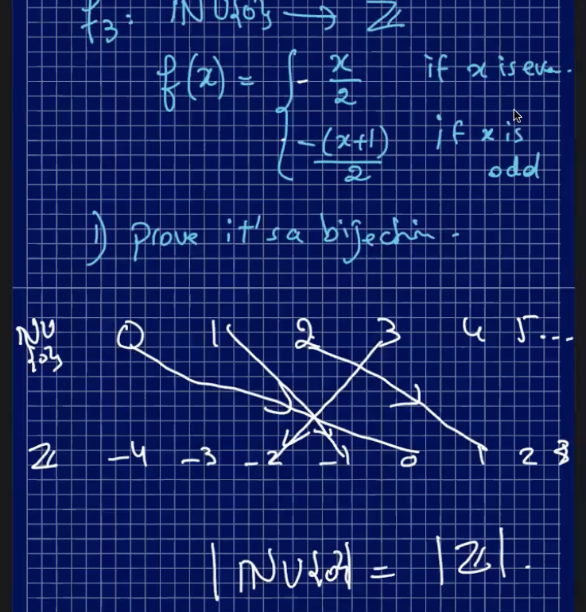

---

## Composition of Functions

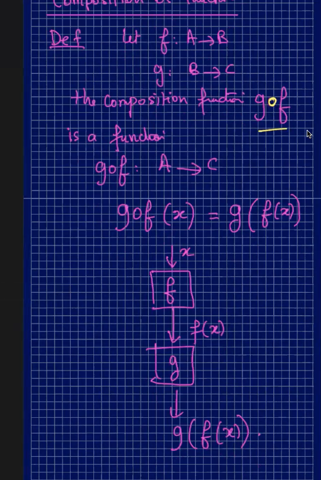

---

### Examples

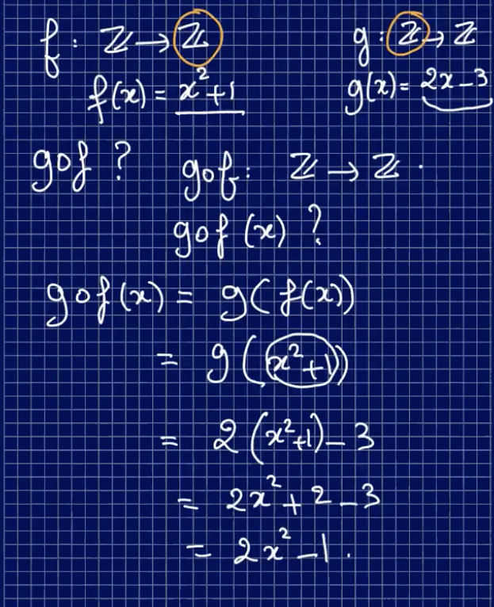

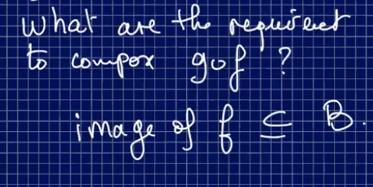

## Composition Preserved Properties

- if you compose two **onto** functions, you get an **onto function**
- if you compose two one-to-one functions, you can a **one-to-one function**

---

## Inverse of a Function

**f: A --> B**

If there exists a function **g**

g: **B --> A**

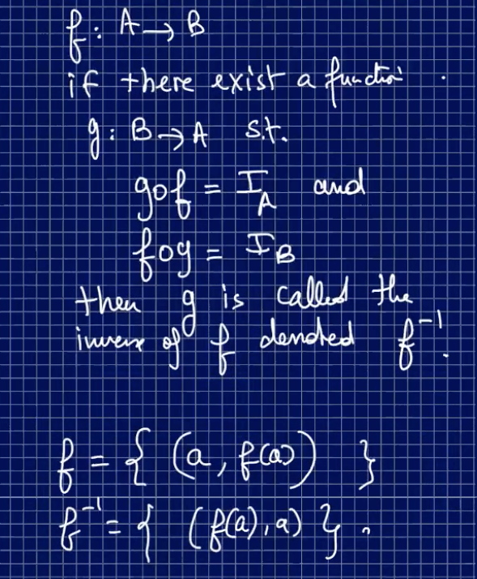

## Identity Function

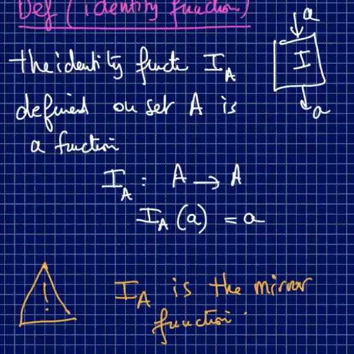

---

## Examples

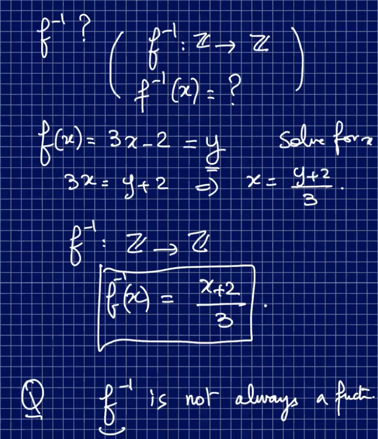

**You must have a bijection if you want to be able to find the inverse**

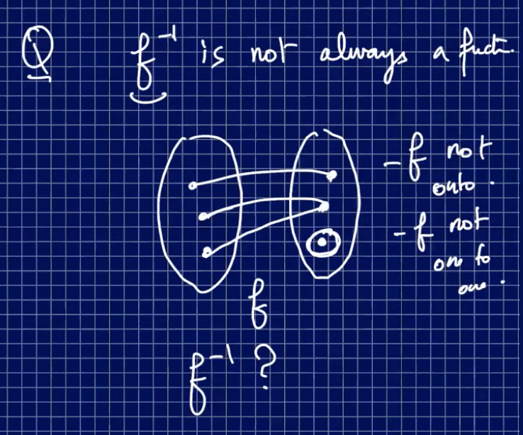

---

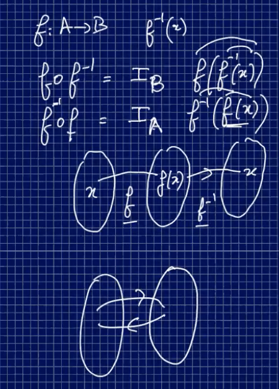

---

**Think of the inverse in terms of encoding and decoding a message, such as below**

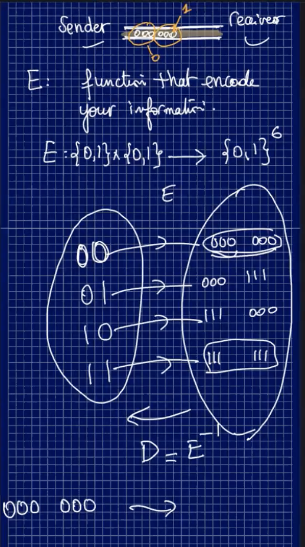

