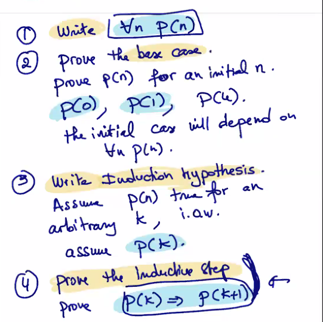
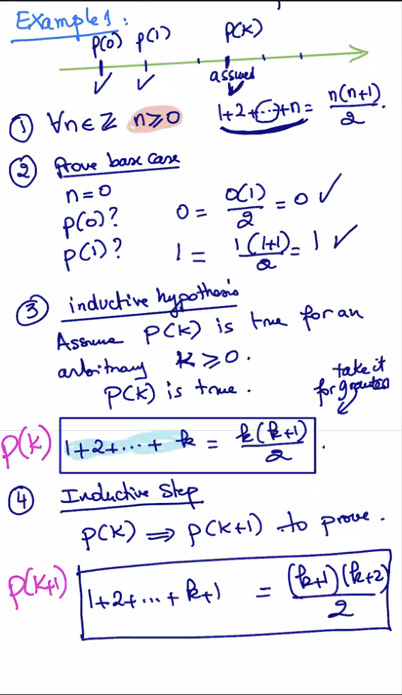
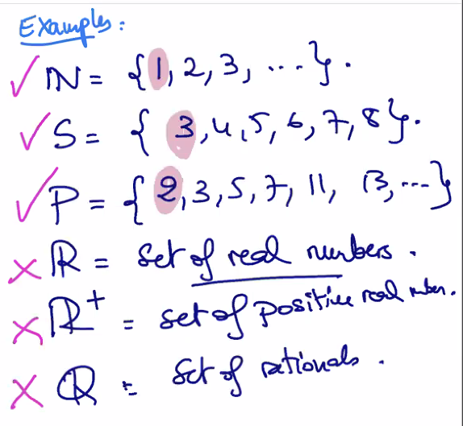
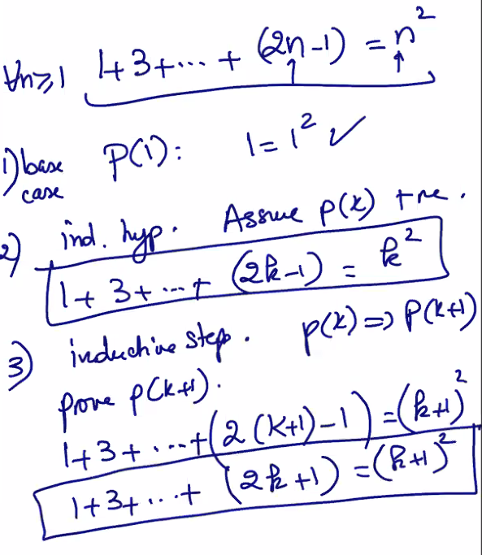
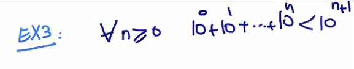
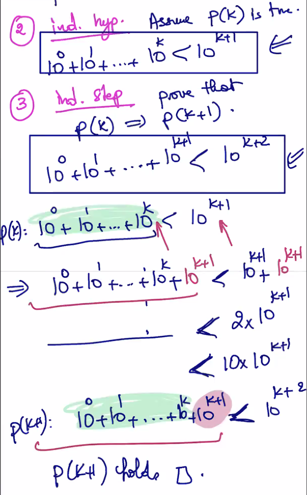
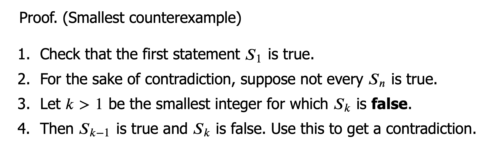
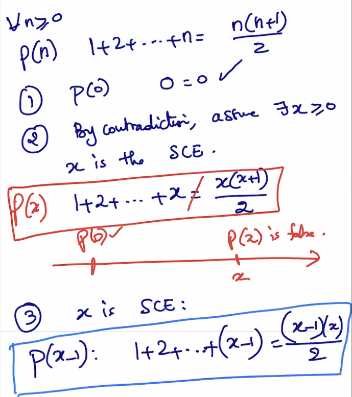

### Lecture 17 at 10:07am on March 22nd, 2021

---

### Proof by Mathematical Induction

*Proof Template*





---

### Def (Well-ordering Principle)

Every set of non-negative integers has a least element 

Take any subset--you will have a starting point

```
Well-ordering Principle is a property of non-negative integers
It states that there is a starting point: the least element
```




---

### Example

**1575 - Francesco Maurolico**

```
The sum of the first n odd positive integers is a perfect square.
1 = 1^2
1 + 3 = 2^2
1 + 3 + 5 = 3^2
1 + 3 + 5 + 7 = 4^2
1 + 3 + 5 + ... + 2(n-1) = n^2
```

Visually, this looks like this (where you continue surrounding with the next odd integer)


---

Try proving it through induction; the template will look like this



---

### Another example





---

### Proof by Smallest Counter Example (equivalent to induction)

*hybrid of induction and proof by contradiction*

**Induction** is base case, assume p(k), prove p(k+1) 

**Smallest Counter Example** is base case, assumed p(x) is false



Prove the base case p(0)

By contradiction, assume there exists a smallest counter example **x** (the exception) such that

p(x) is **false**

p(x-1), (p(x-2)) ... are all true because **x** is the smallest counter example

Show that p(x) is false, p(x-1) is true

**This leads to a contradiction**

---

### Example



