### Lecture 18 at 10:02am on March 24th, 2021

---

**Proof by Induction and Smallest Counterexample are equivalent**

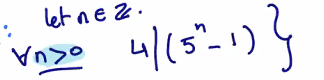

**Smallest Counterexample**

---

1. **Base Case**

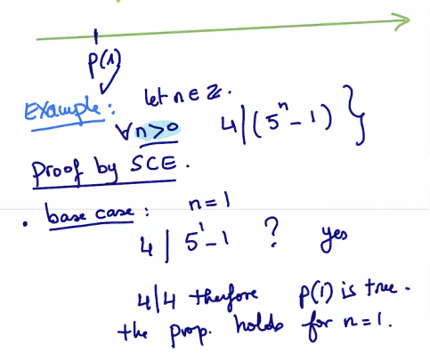

2. **By contradiction**, *assume* there **exists an x > 0**, where **x is the smallest counterexample** (the property doesn't hold for this)

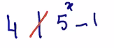

3. **p(x) is assumed false**, and since **x** is the smallest counterexample, **then p(x - 1), p(x - 2) ... are all True**
4. 

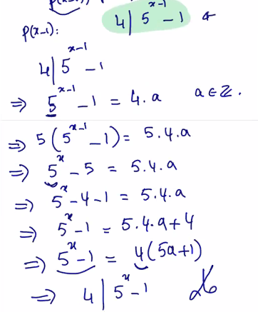

**We assumed that 4 does not divided** `5^x - 1`. 

Therefore, the proposition there does not exist and **x** (SCT) such that p(x) is false.

**END**

---

Ex.

**Prove every integer is either odd or even**

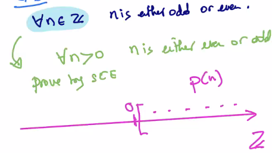

---

1. **p(1)**: 1 is odd, **p(2)** is even
2. **By contradiction**, supposed that **there exists an x > 0** such that **x** is the smallest counterexample and **p(x)** is False (**where x is not even nor odd**)
3. p(x - 1) is **True** because **x** is the smallest counterexample

Case 1: x - 1 is even

x - 1 = 2a for some **a in Z**

x = 2a + 1

x is **odd**

*or*

Case 2: x - 1 is odd

x - 1 = 2a + 1 for some **a in Z**

x = 2a + 2 = 2(a + 1)

x is **even**

Therefore, **we've reached a contradiction**, with an assumption that **x is neither even nor odd**

**END**

---

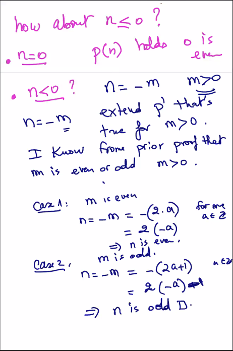

---

## Proof by Strong Induction

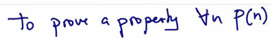

1. Prove the base case p(0), p(1),... p(n^0)
2. Inductive Hypothesis: **Assume p(k) holds for all numbers less or equal than an arbitrary k**

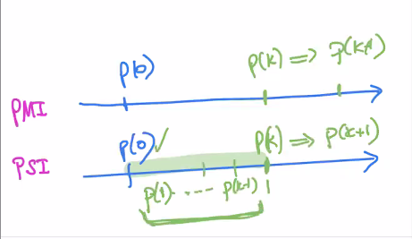

3. Inductive Step: **Prove p(0) AND p(1) ... AND p(k) --> p(k+1)**

   In regular induction, it's **assume p(k) prove p(k+1)**

---

**Example**

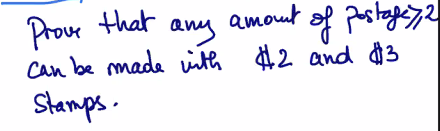

**Proof by Induction**

1. **Base Case: p(2), p(3), p(4), p(5)...**

*p(2) use one 2 cents stamp*

*p(3) use one 3 cents stamp*

*p(4) use two 2 cents stamps*

*p(5) use one 2 cents stamp and one 3 cents stamp*

...

2. 

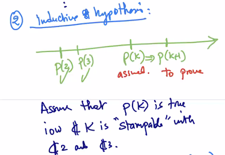

3. 

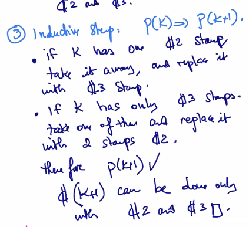

---

**Proof by Strong Induction**

1.

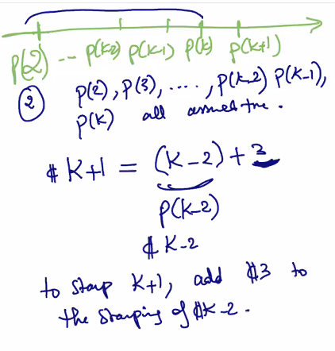

**We assumed (k - 2) is True**

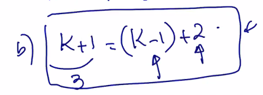

**END**

---

**Proof by Strong Induction gives more flexibility than Proof by Induction**

---

Ex.

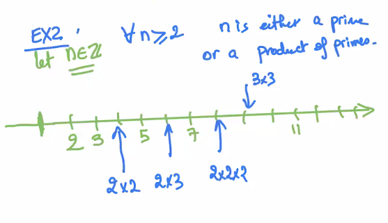

**Prove this by Strong Induction**

1. p(2) -------> 2 is a prime

   p(3) -------> 3 is a prime

   p(4) -------> 4 is a product of primes (2 x 2)

   p(5) -------> 5 is a prime

2. **Inductive Hypothesis:** Assume p(2), p(3), ..., p(k) are all True
3. Inductive Step: p(k + 1) is True ?

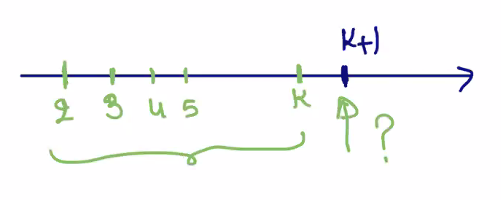

Prove (k + 1):

k + 1 is a prime or a product of primes

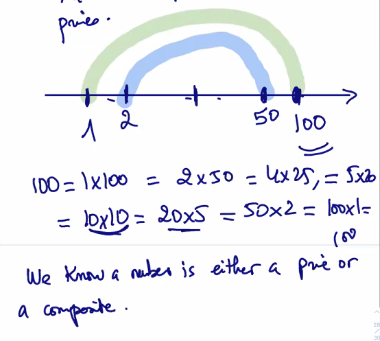

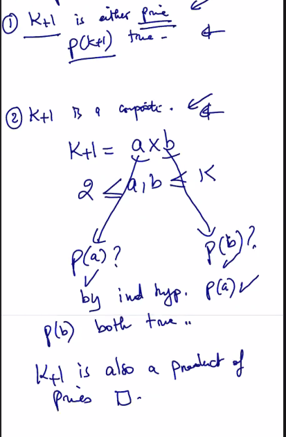

