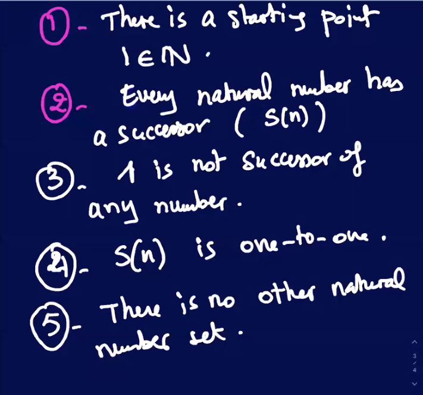
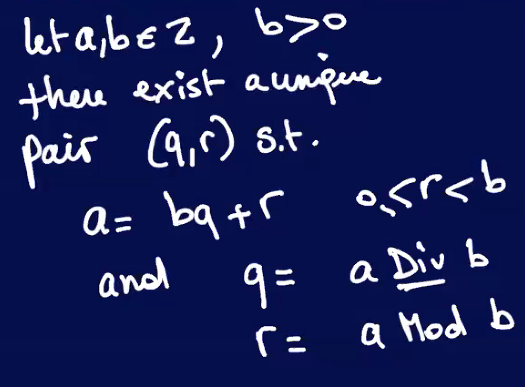

### Lecture 19 at 10:11am on March 29th, 2021

---

## <u>Number Theory</u>


### Axioms from 1880



---

## <u>Divisibility</u>

**Theorem (Divisibility)**: 

```
Let a, b in Z

b > 0. There exists two integers q and r such that

a = bq + r

=====================(a can be written as b times q plus the remainder)=====================
```


Ex.

25 = 2x == 10 * 2 + 5

-25 = 10 * -3 + 5 (**remainder is NEVER negative**)

## Corollary (consequence of the theorem):

***Every integer is either odd or even, but not both***

Proof: Using **Theorem of Divisibility**:

We can take any number, and divide it by 2 to determine if it is **even or odd depending on if the remainder is 0 or 1**


---

## <u>Def (Div, Mod Operators)</u>



Mod is an operator, but recall that we saw it as a relation.

**Recall:**

- congruence modulo as a relation


- Mod is an operator! It gives the remainder of div. of **a** by **b**


(The remainders are the same)


### Def (Common Divisor):

Let a,b be two integers

d is a positive integer

d is called a common divisor provided **d|a** and **d|b**

---

### Def (Greatest Common Divisor or Factor (GCD or GCF)):

Let a, b in Z. We call d in positive Z **the GCD of a,b** denoted

`GCD(a,b)`

iff

1. d|a **AND** d|b (d is a common divisor)
2. d is the greatest divisor of all common divisors


You could write the divisors as sets:

```
D_14 = {1,2,7,14}
D_21 = {1,3,7,21}

D_14 INTERSECT D_21 = {1,7}
GCD(14,21) = 7
```


---

## Euclid's Observation about GCD:

- ~2300 years ago!
- a good shortcut to find the GCD


Thus, **gcd(75, 63) = 3**

Another way to write this is:

```
gcd(75,63) == gcd(63, 12) == gcd(12,3) == 3

or

gcd(75,63,12,3,0)
```

---

### Proposition (Euclid's Observation):

Let a,b be two positive integers

**gcd(a,b) = gcd(b, a mod b)**

### Proof for GCD Algorithm


