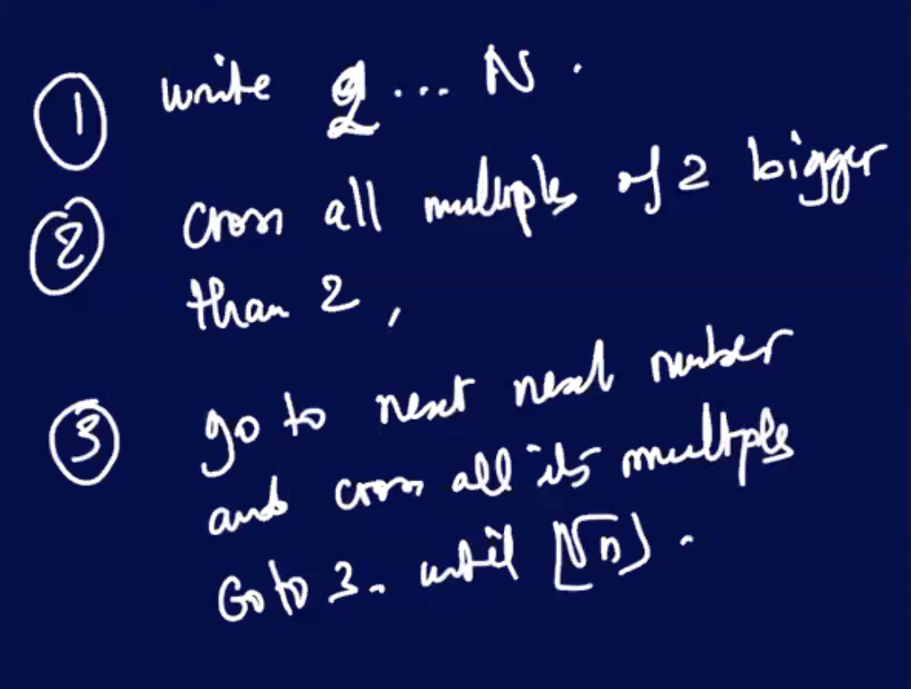

### Lecture 20 at 9:54am on March 31st, 2021

---

### Euclid's Observation

gcd(a, b) = gcd(b, a mod b)

Let a,b,q, r **in Z** 

a = ba + r 

where r is greater than or equal to 0 and b > 0

gcd(30, 24)

30 = 24 x 1 + 6

3 | 30 and 3 | 24

- if 3 divides 30 and 3 divides 24, 3 must also divide 6 (linear relationship)

Divisors of 30 = {1,2,3,6,10,15,30}

Divisors of 24 = {1,2,3,4,6,12,24}

Divisors of 6 = {1,2,3,6}

---

Divisors of 30 **INTERSECT** Divisors of 24 = Divisors of 24 **INTERSECT** Divisors of 6

---

Proof:

gcd(a,b) = gcd(b,r)

a = bq + r 

Let c be a divisor of **a** and **b**

a = cq_1

b = cq_2

### Def (Coprime or Relatively Prime):

### Theorem

There is an infiniity of prime numbers

### Lemma

---

## Proof for Kummer 1878

There is an infinity of prime numbers

**By contradiction, suppose there is a largest number (a finite number of primes).**

P_1, P_2, ..., P_r

Let X = P_1 x P_2 x P_r, a composite... because **P_r is the largest prime**

x + 1 is also composite

Then **x and x + 1 must share at least one prime p_1, p_2, ..., p_r**

Let's call it **p_i**

