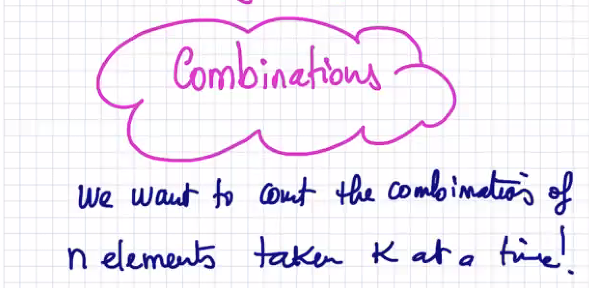
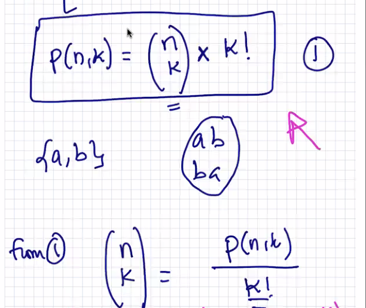
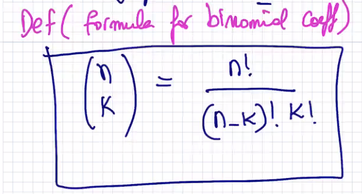

Lecture 21 at 10:06am on April 5th, 2021

---

## Counting/Combinatorics

**Counting lists**: permutations, anagrams, multiplication theorem

**Counting Sets**: Combinations, binomial theorem, pascal triangle

**Counting the size of sets**: principle of inclusion exclusion (pie)

---

### Theorem (Size of Power Set)

Let **S** be a finite set of cardinality n ≥ 0

|S| = n ---> |P(S)| = 2^n


---

Ex. 


---

## Proof by Induction

Prove:


---

### Counting Lists

1. You have 2 pairs of sneakers, 3 pairs of flip flops

**How much footwear do you have?**

3 + 2 = 5 possible pairings.

This is called the **Addition Principle**

---

2. You have 5 shirts,  3 pants, and 2 pairs of shoes.

**How many different outfits can you make?**

5 * 3 * 2 = 30 possible outfits

This is called the **Multiplication Principle**


---

3. How many **odd** two-digit numbers are between 10 and 99


---

4. How many 10-digit phone numbers are there?


---

5. 

   ---

6. You toss a coin 4 times.

HHHH, HHHT, ...


---

7. You have **10 members in a club**

President, Vice President, Treasurer


We can't repeat the digits in this example because we have a finite number of members

n, n-1, n-2, **n-k+1**

10, 9, 8, 10 - 3 + 1


---

### Theorem (The Multiplication Theorem):

The number of lists of size **K** whose elements can be chosen from a pool of **n** elements is:


**If repetitions are NOT allowed**:


This is **(n)_k**:


---

Ex.

```
How many 3-letter words can we make with 26 letters of the alphabet if repetitions are allowed?

What about if repetitions are not allowed?
```

1. **If repetitions are allowed**


2. **If repetitions are not allowed**


---

## Permutations

The number of arrangements of **K** distinct elements chosen from **n** distinct elements, where **repetitions are not allowed**


---


This is simply the **fallen factorial**


---

## Anagrams

Anagrams **are permutations of letters in a word with no repetitions**

Words can be non-sensical.

**Ex.**

How many anagrams can we make with the word **Math**?

```Math, Maht, ...```


---

Ex. 


---


---

## Def (Number of Anagrams):

Let an **n-letter** word with **K** unique letters, where letter **i** appears **n**_i times.


---

What if we don't care about order?



### Def (Combinations)

The set of **k-element** subsets of an **n-element** set for:


---

## Def (Binomial Coefficient):


Ex.


p(4,2) = 






