Lecture 22 at 10:12am on April 7th, 2021

---

## Counting Continued

```
How many subsets of size K does an n-element set have?
```

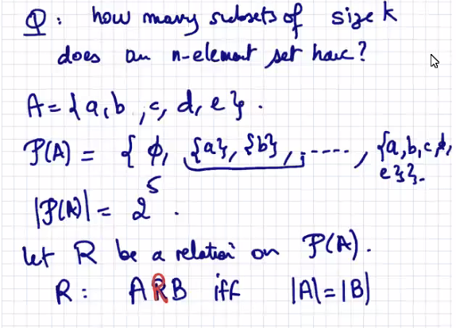

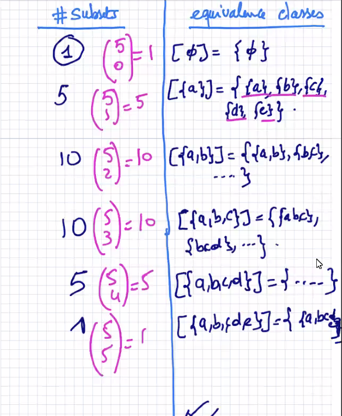

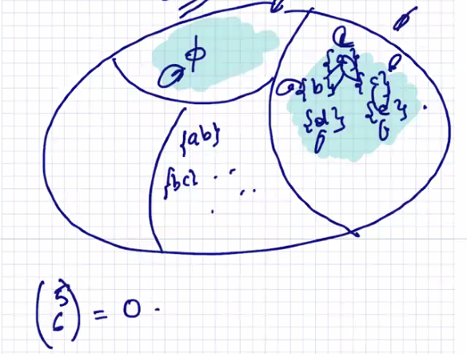

---

Mathematicians saw a connection between (the binomial coefficients when you expand):

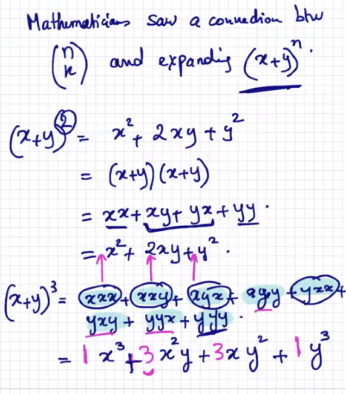

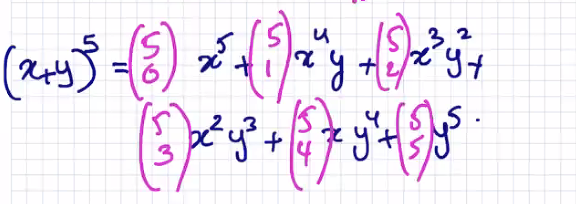

---

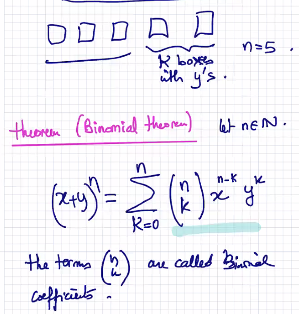

---

Ex. 

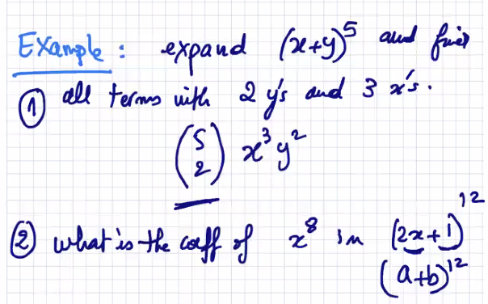

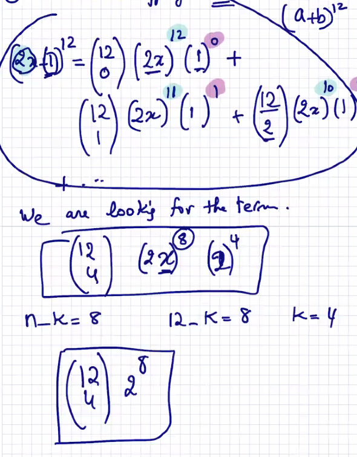

---

Ex.

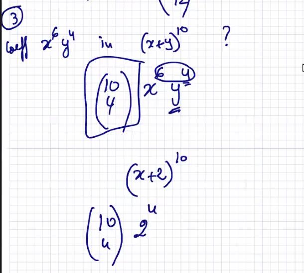

---

## Pascal's Triangle

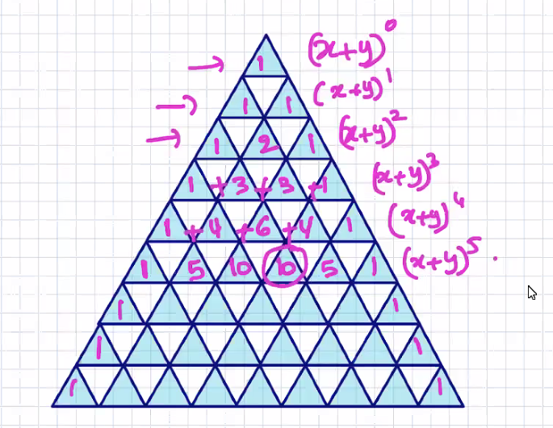

---

### Theorem (Pascal Identity)

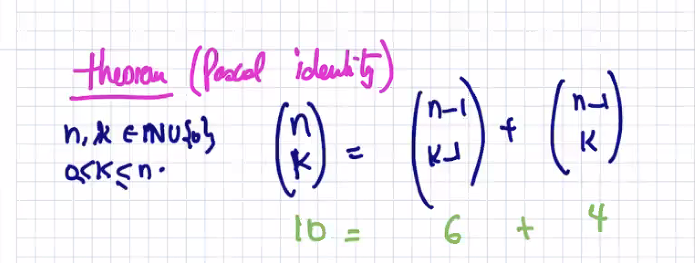

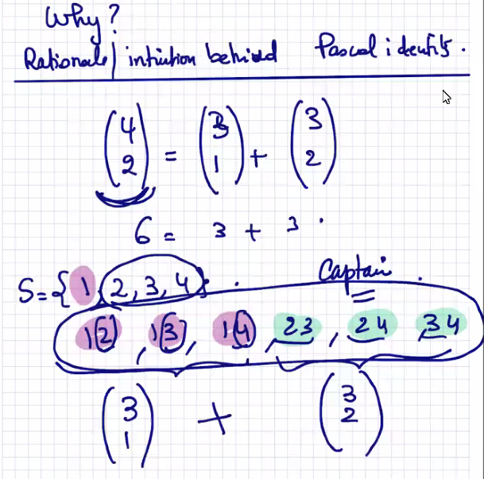

---

### Theorem 2:

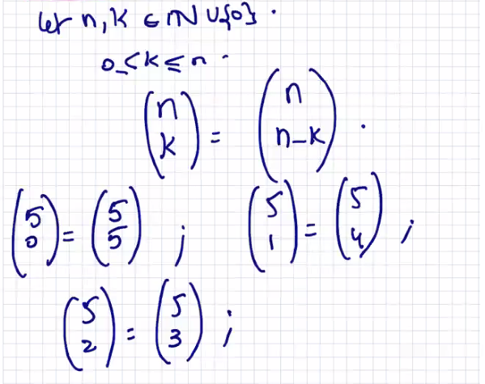

---

Ex.

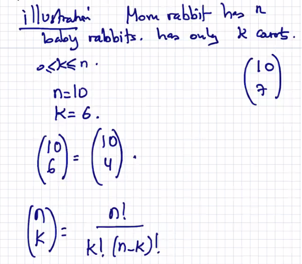

---

## Principle of Inclusion Exclusion (Pie)

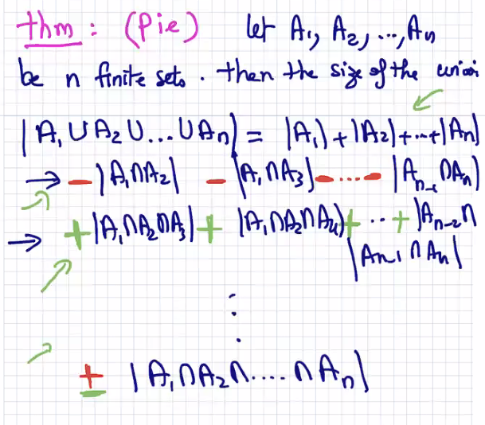

---

If you do the following, you will double count

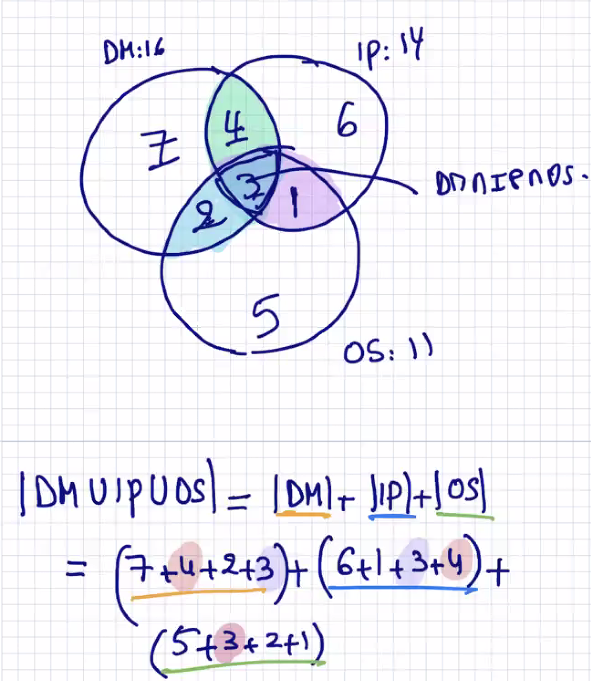

So if you don't want to double count, you need to subtract:

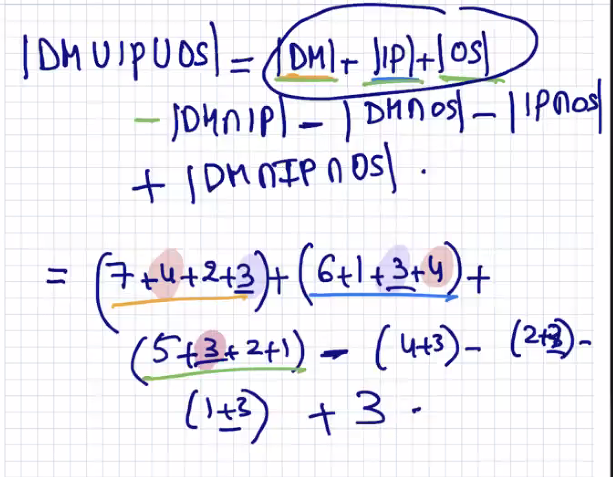

---

**Important Note**

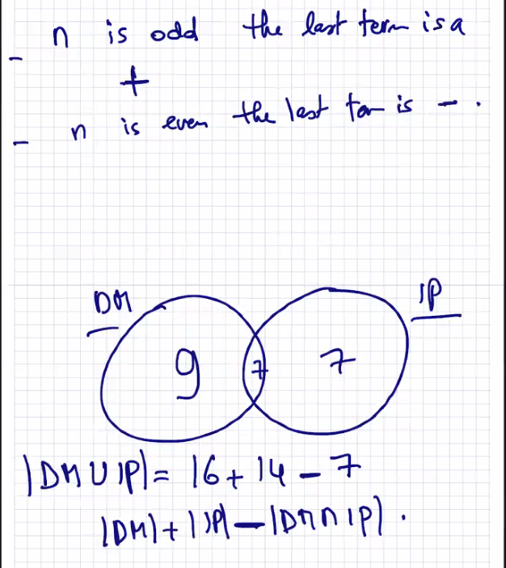

---

Ex.

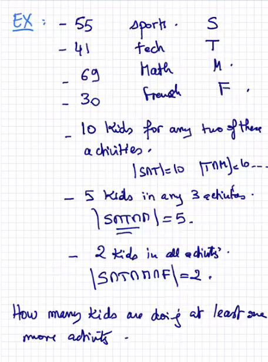

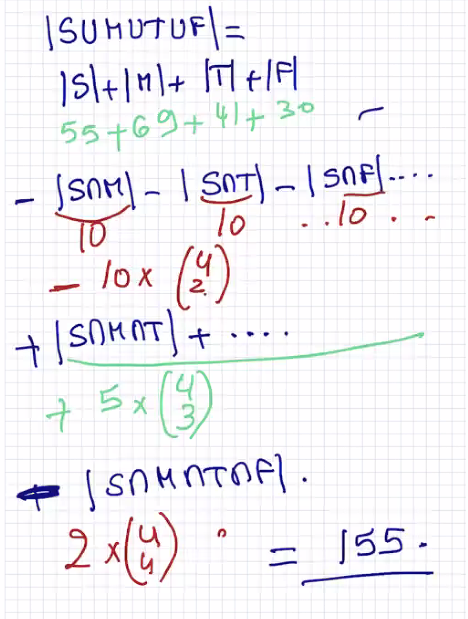

---

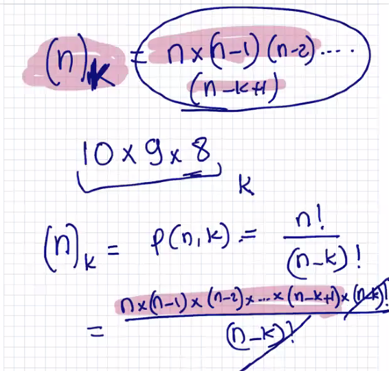

