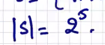
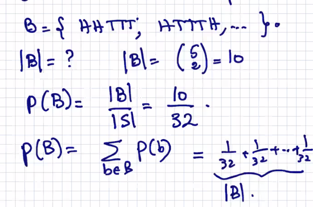

#### Lecture 23 at 10:10am on April 12th, 2021

## Probability

---

### Def (Random Experiment)

A **random experiment** is when the outcome **cannot be predicted with certainty**, but **the set of possible outcomes is known (sample space)**

---

### Def (Sample Space)

The sample space **S** is **the set of all possible outcomes** of an experiment

---

Ex. **Flip of a coin**:

**S = {H, T}**

We can't actually predict what we will get, but we know the sample space

---

Ex. **Roll of a die**:

**S = {1,2,3,4,5,6}**

---

Ex. **The flip of a fair coin, two consecutive times**:

**S = { (H, H), (H,T), (T,H), (T,T) }**

---

Ex. **Six horses in a race** (with initial positions of 1,2,3,4,5,6,):

**S = {123456, 213456, 312456, ... }**

**| S | = 6!**


---

Ex. **Roll two distinguishable dice**:

| S | = ?


---

### Def (Probability Space)

A probability space consists of a sample space **S**, and a probability function **p** that takes an outcome **s in S**, and returns the probability of **s**

```
The sum of the probability of all the outcomes is 1
```


We use **(s, p) to denote the probability space**


---

Ex. **Suppose we toss a fair coin 3 times**:

**S = {TTT, TTH, THT, THH, HTT, HTH, HHT, HHH}**


---

### Def (event)

An event **is a subset of S**


If we're looking for the amount of times that we get exactly **two tails**, that's an event

---

### Def (probability of an event)

Let **A** be an event

The probability of A is the sum of the probability of all outcomes in A


---

Ex. **We toss a fair coin 5 times in a row**

**1) A** denotes the event that exactly one Heads emerges**

A = ?

S = **{ HHHHH, HHHHT, ...... }**

#### 


---

Ex. Let **B** be an event:

**B: two heads show up**




---

## Axioms of Probability


---

## Conditional Probability

### Def (Conditional Probability):


---

Ex. **We roll two fair dice, and observe that the first die is a 4**

What is the probability that **the sum of the two dice is equal to 6**


---

Ex. 

**A family has two children. What's the conditional probability that both are boys given that at least one of them is a boy? Assume outcomes are equally likely.**

**Let A: Both are boys**

**Let B: At least one is a boy**


---

### Marginals and Total Probability Rule


