### Lecture 24 at 10:11am on April 14th, 2021

## More Probability

---

**The probability axioms are important to know**

### Marginals and Total Probability Rule

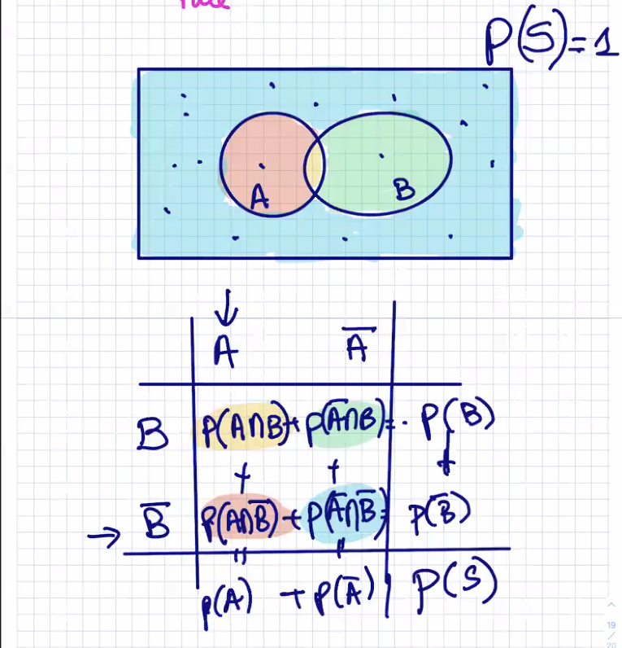

The sums will be **P(S), which is 1**

### Def (Total Probability Rule)


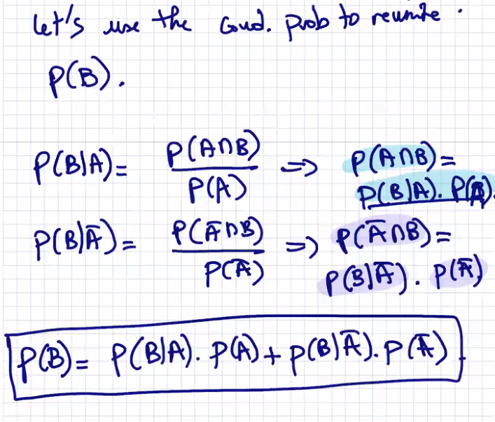

---

## Bayes Rule

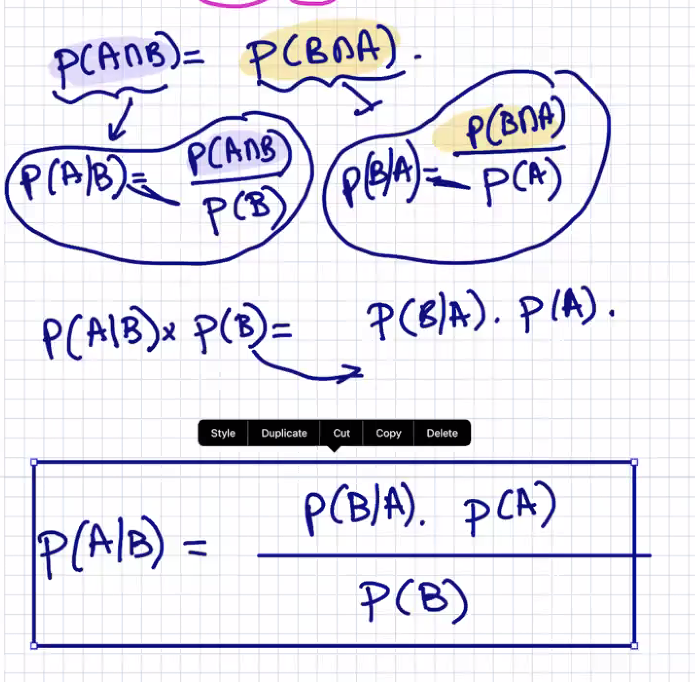

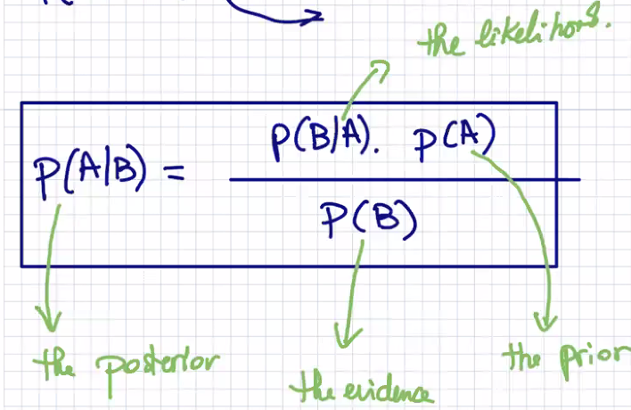

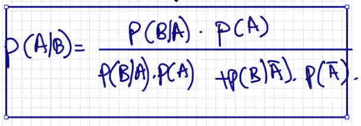

---

Ex.

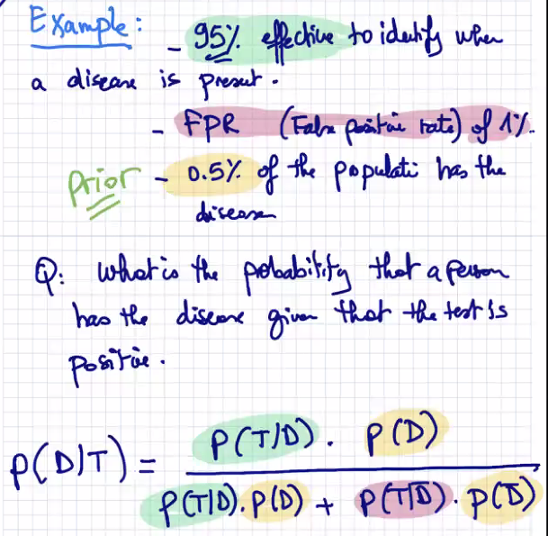

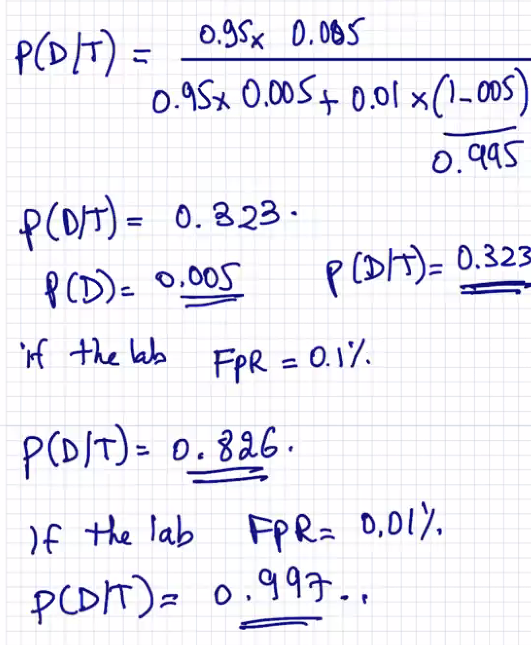

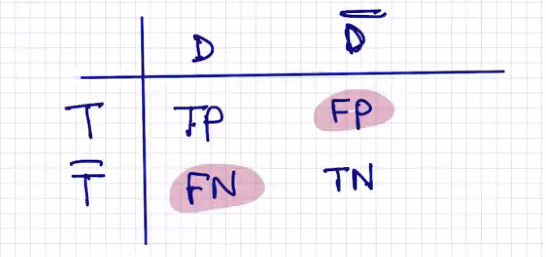

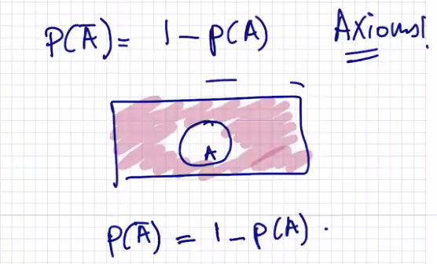

---

## Intersection of Events

### Def (Independence):

Two events **A,B** are independent provided **their joint probability** is the product of their marginals

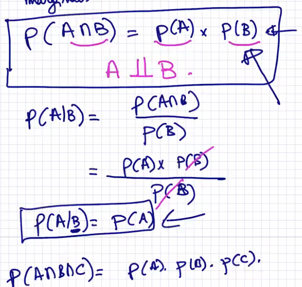

---

Ex.

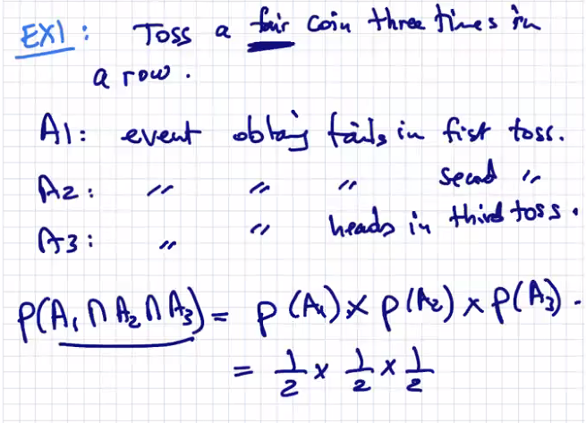

---

Ex.

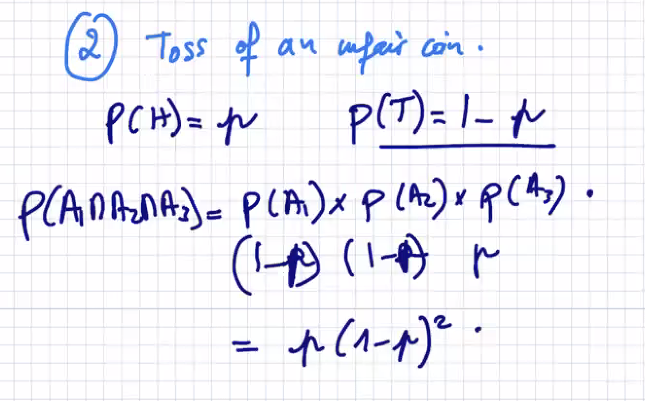

Event of One Sequence

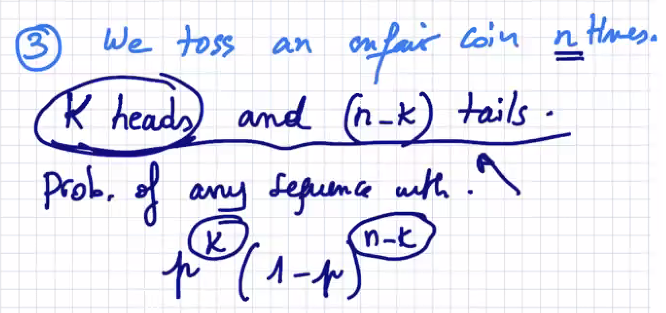

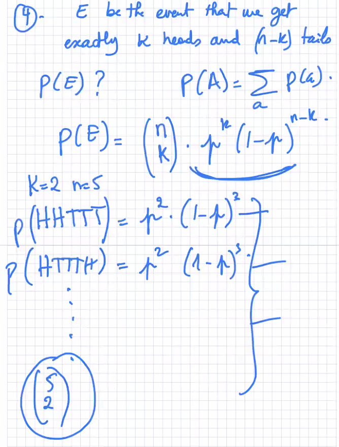

---

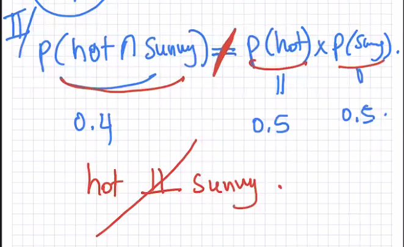

---

**What if the events are not independent?**

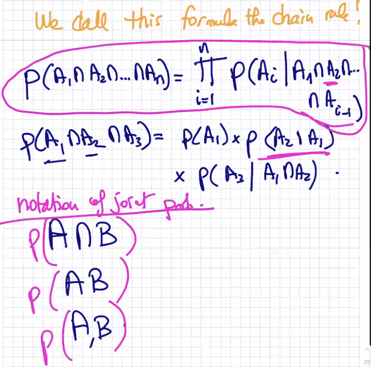

---

## The Union of Events

**Use the Principle of Inclusion/Exclusion**

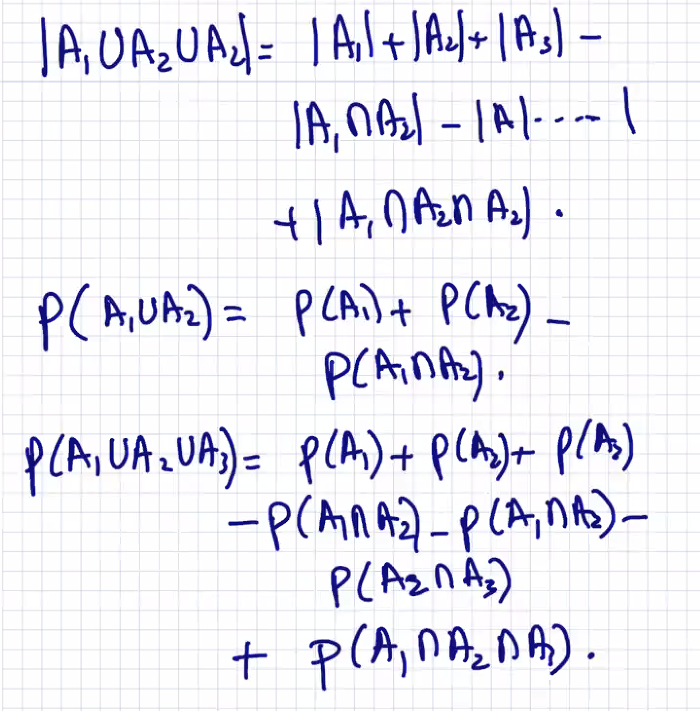

---

## Random Variables

We have experiments. We want to make some calculations or measurements. 

---

Ex.

```
We toss a fair coin three times. We want to measure the number of heads in the outcomes. 
Let this measurement be called a random variable X.
```

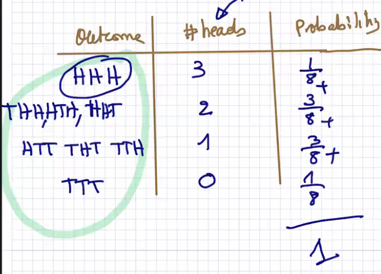

---

### Def (Random Variable):

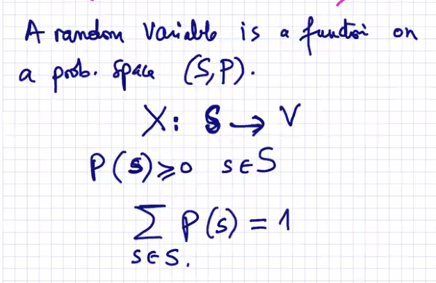


