 ## Notes at 10:18am on January 27th, 2021

---

In many situations, you can **undistribute** if you need to go backwards

If you are getting rid of a variable, try to put it with a **True** w/ Disjunction, or **False** with Conjuction

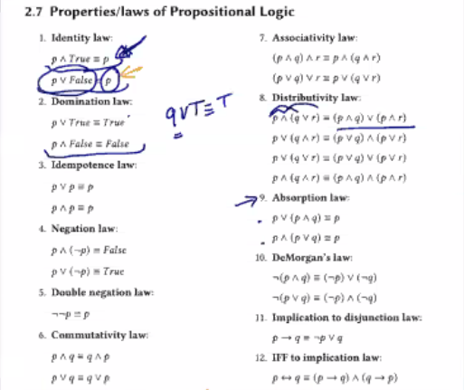

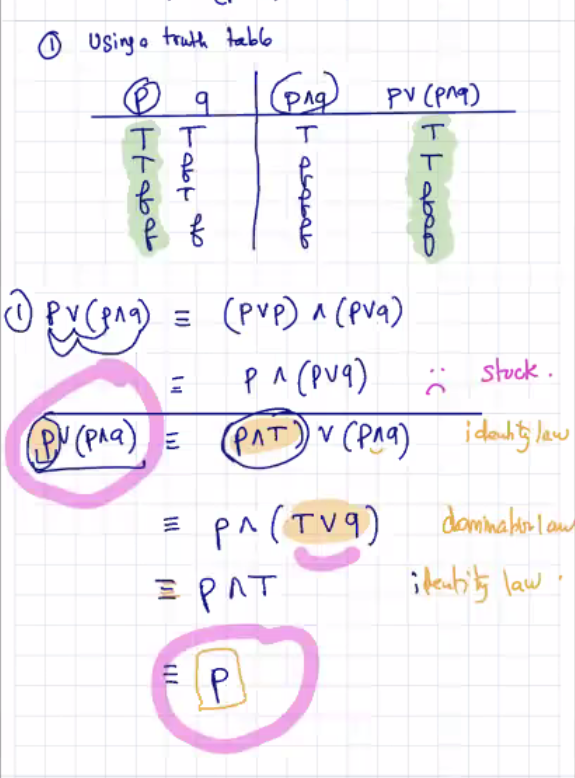

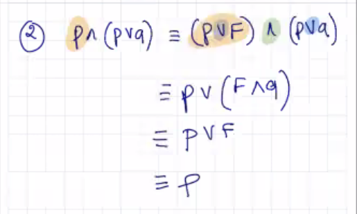

---

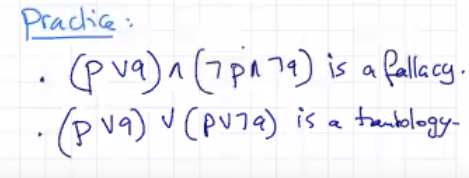

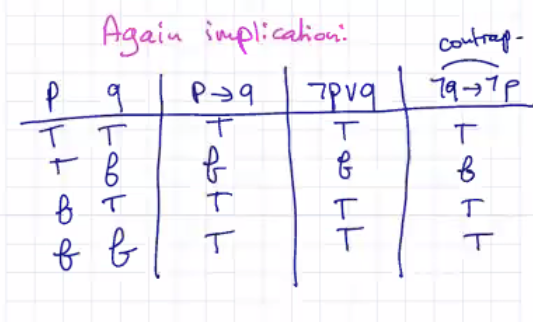

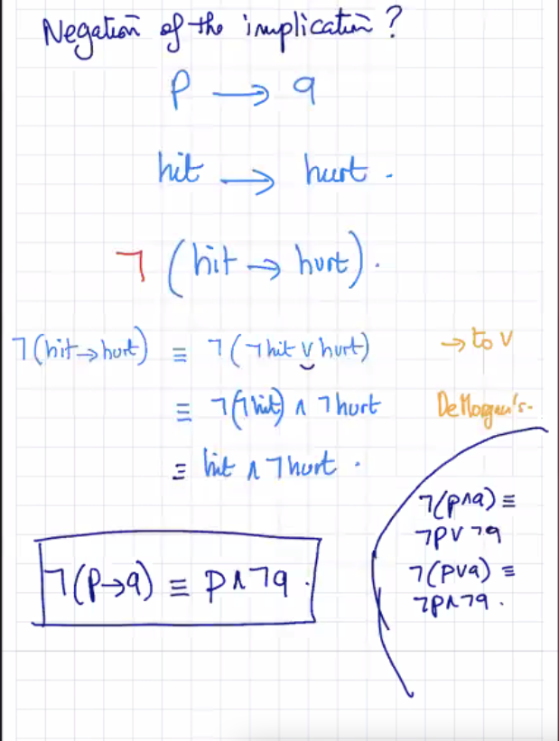

---

## Logical Inference

### Def (Argument):

### (note: a valid argument is always True)

An argument in propositional logic **is a sequence** of propositions such that:

1) All but the last propositions are called premises. *p1, p2,...,pn*

2) The last proposition is called the **conclusion**

3) The argument is valid provided **the premises imply the conclusion** (q)

- in other words: *p1 AND p2 AND p3 AND ... AND pn ----> q is a tautology* (**TRUE**)

### Notation

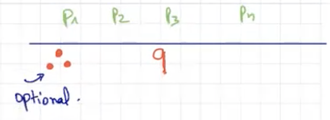

**A valid argument is an implication that is always True**

In general, to prove that an argument:

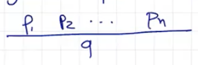

Prove that the above is a **Tautology**

If **True or anything**, it is always True

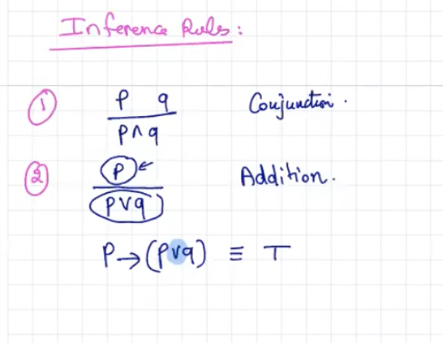

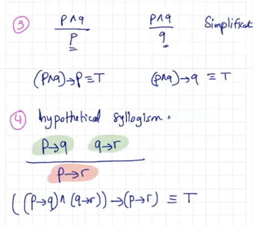

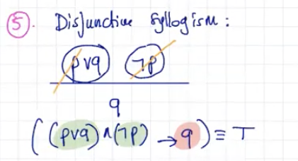

Since NOT(*p*) is **True**, then the True from the left statement is from *q*

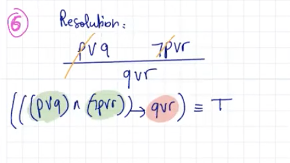

