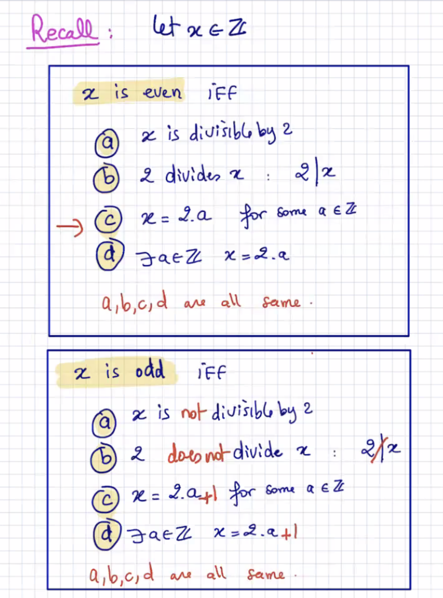
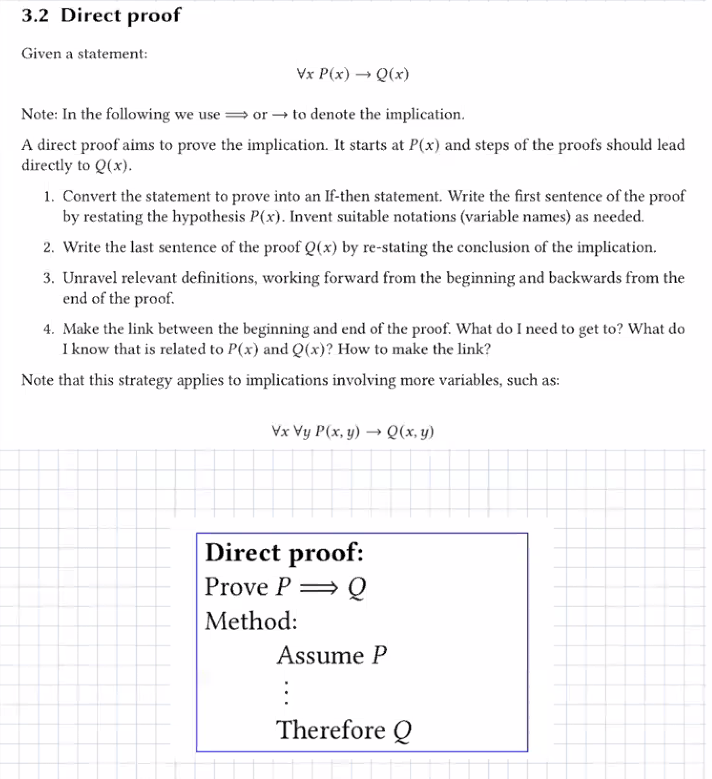
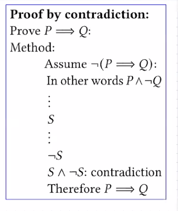
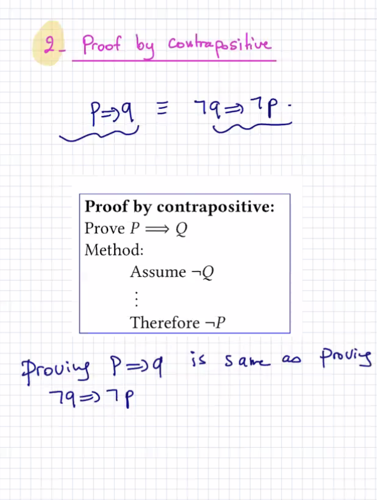
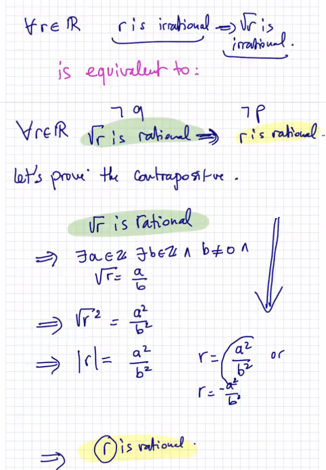
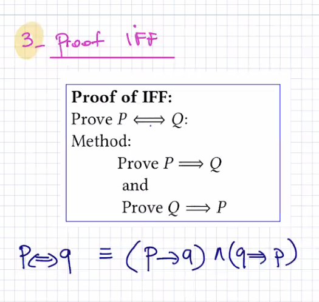
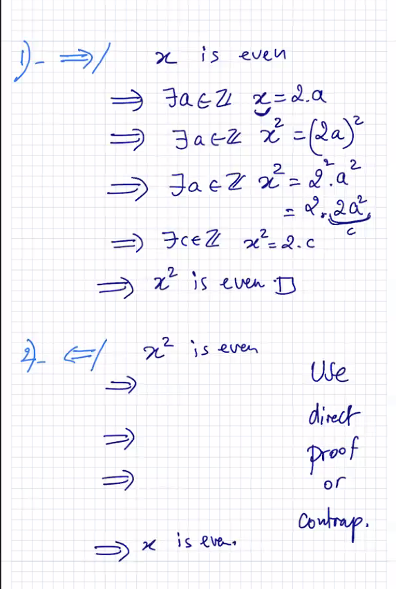
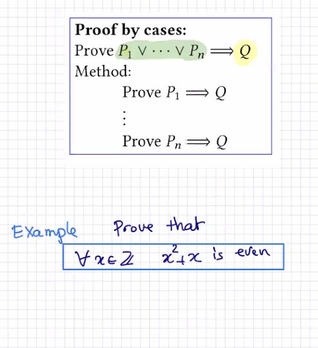

## Lecture 9 at 10:09am on February 10th, 2021

---

---

## Direct Proof

---

## Proof by Contradiction

Assume the negation of what you want to prove

---

## Proof by Contrapositive

you might want to start your proofs with equivalences 

you can do a direct proof of the contrapositive

Example

---

## If and Only If Proof

---

## Proof by Cases

