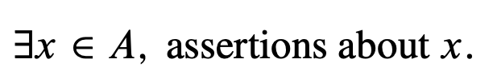
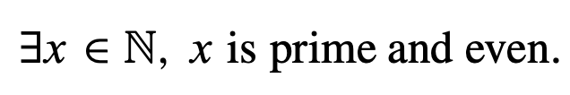
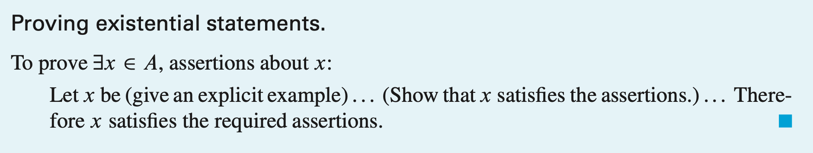
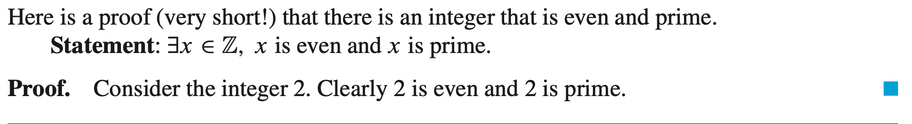
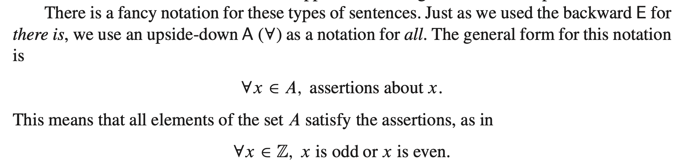
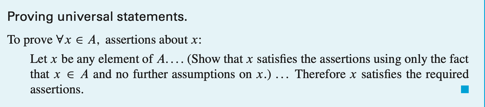
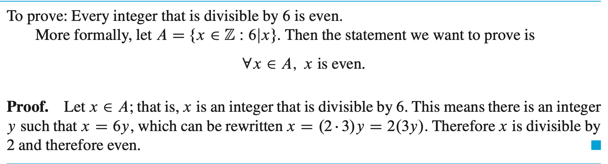
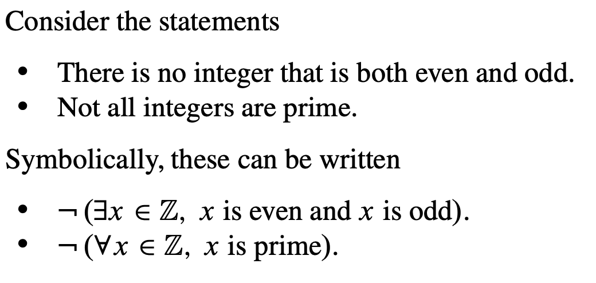
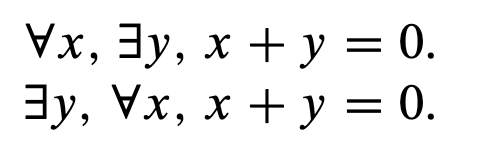
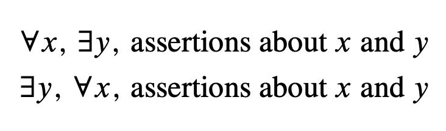

## Quantifier Notes at 8:58am on January 25th, 2020

---

## There Is

```
There is a natural number that is prime and even
```

can be more strictly written as

```
There is an x, a member of N, such that x is prime and even
```

The phrase *there exists* is synonymous with *there is*.

---

### Notation



This means "there is" or "there exists" an *x*, a member of the set *A*, for which assertions hold

---



**There is a natural number that is prime and even** 

Note that *x* is a placeholder

---

**If context makes it clear, we don't need to necessarily state what object x is** (a natural number, for example)

The backward E is called the *existential quantifier*

To prove the first example, we have to show that some element in A satisfies the assertions.





---

## For All

We say *every*, or *all, each, or any*

- *Every* integer is either even or odd.
-  *All* integers are either even or odd.
- *Each* integer is either even or odd.
- Let x be *any* integer. Then x is even or odd.



**Again, if the context is clear, you don't need to state what type of object it is**

To prove an “all” theorem, we need to show that every element of the set satisfies the required assertions. 





This is similar to just saying "If *x* is divisible by 6, then *x* is even", but the point is that we assume *x* is an arbitrary element of *A* and then we move on to prove that.

### Negating



**This means that none of the elements of A satisfy the assertions, and this is equivalent to saying that *all* of the elements of A fail to satisfy the assertions.**

## Combining Quantifiers




First we begin by considering *x*, an arbitrary integer. Then we do something about it: y = -x since x + y = 0

**However**, the second statement is false. We can always find an integer x such that x + y is not zero.

The following two statements are **generally not logically equivalent**

