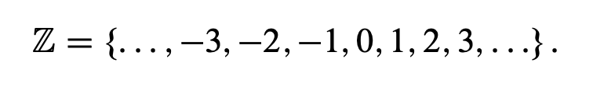

### Study Notes at 9:45pm on January 14th, 2020

### Def (even)

---

```
An integer is called even provided it is divisible by two.
```

---

- this definition is not clear because we haven't defined **integer, divisible, or two**

- **integers** are the **positive and negative whole numbers**, **including Zero**

  -  *the set of integers*

  

- we are **allowed to assume that we know how to add, subtract, and multiply, and we need not prove basic number facts such as**

```
3 x 2 = 6
```

- we are **allowed to assume basic algebraic properties of addition, subtraction, and multiplication and basic facts about order relations (I.e., greater than, less than, equal to)**
  - **we cannot assume the properties of division**, meaning that we can't assume we know what *divisible* means

Therefore, if we are defining **integer**, we don't need to define *integer* or *two*

- we must define *divisible*

---

```
(Divisible) Let a and b be integers. We say that a is divisible by b provided there is an integer c such that bc = a. We also say b divides a, or b is a factor of a, or b is a divisor of a. The notation for this is b|a.
```

---

So now we can check these definitions. The number 12 is even because 2 | 12, and we know 2 | 12 because 2 * 6 = 12. On the other hand, **13 is not even** because 13 is not divisible by 2; there is no integer for which 2x = 13. **However, we cannot say that 13 is odd** because we have not defined odd yet. 

- at this point, we can only say that **13 is not even**

---

### Def (odd)

---

```An integer a is called odd provided there is an integer x such that a = 2x + 1.```

---

Thus 13 is odd because we can choose x = 6 in the definition to give 13 = 2 * 6  + 1. **Note that the definition gives a clear, unambiguous criterion for whether or not an integer is odd.**

- note that we don't just say **it's odd if it is not even**...

---

### Def (prime)

```
(Prime) An integer p is called prime provided that p > 1 and the only positive divisors of
p are 1 and p.
```

For example, 11 is prime because it satisfies both conditions in the definition: First, 11 is greater than 1, and second, the only positive divisors of 11 are 1 and 11.

However, 12 is not prime because it has a positive divisor other than 1 and itself; for example, 3j12, 3 6D 1, and 3 6D 12.

- To see why, take p = 1 and see if p satisfies the definition of primality. There are two conditions: First we must have p > 1, and second, the only positive divisors of p are 1 and p. The second condition is satisfied: the only divisors of 1 are 1 and itself. However, p = 1 does not satisfy the first condition because 1 > 1 is false. **Therefore, 1 is not a prime.**

### Why are we excluding '1' in our definition?

- firstly, *prime number* is well established in the mathematical community
  - you'd need a different name for your definition if you choose to include '1'
- **most importantly**, the idea is that the prime numbers should form the “building blocks” of multiplication
  - every positive integer can be factored in a unique fashion into prime numbers

```
12 can be factored as 12 = 2 x 2 x 3	
```

- **there is no other way to factor 12 down to primes**
  - *if we had 1 as a prime number, we would also be able to factor 12 into*

```
1 x 2 x 2 x 3
```

**Therefore we exclude 1**

---

### Def (composite)

```
A positive integer a is called composite provided there is an integer b such that
1 < b < a and b|a.
```

ex. 25 is composite because ***there is a number b with 1 < b < 25 and b | 25; indeed, b = 5 is the only such number.***

Similarly, the number 360 is composite. In this case, there are several numbers b that satisfy 1 < b < 360 and b | 360.

Prime numbers are not composite. If p is prime, then, by definition, there can be no divisor of p between 1 and p 

Furthermore, the number 1 is not composite. (Clearly, there is no number b with 1 < b < 1.) Poor number 1! It is neither prime nor composite! (There is, however, a special term that is applied to the number 1—the number 1 is called a *unit*.