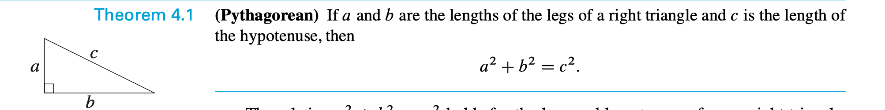
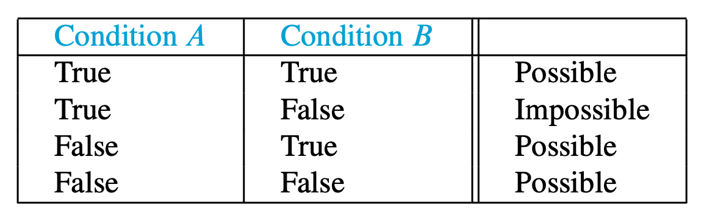
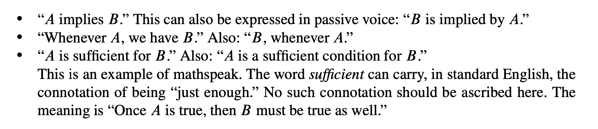
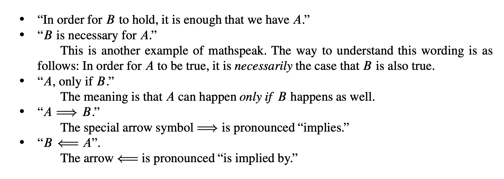
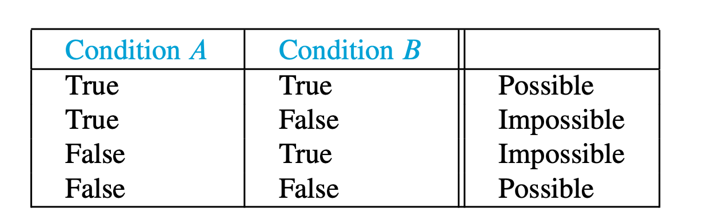
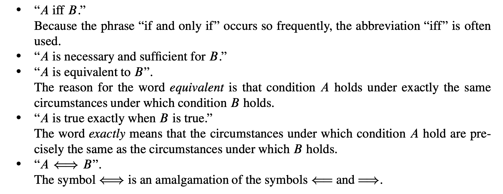
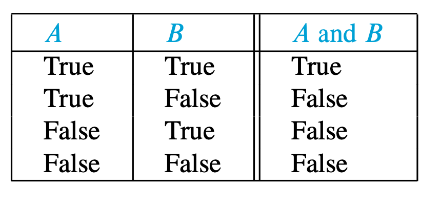
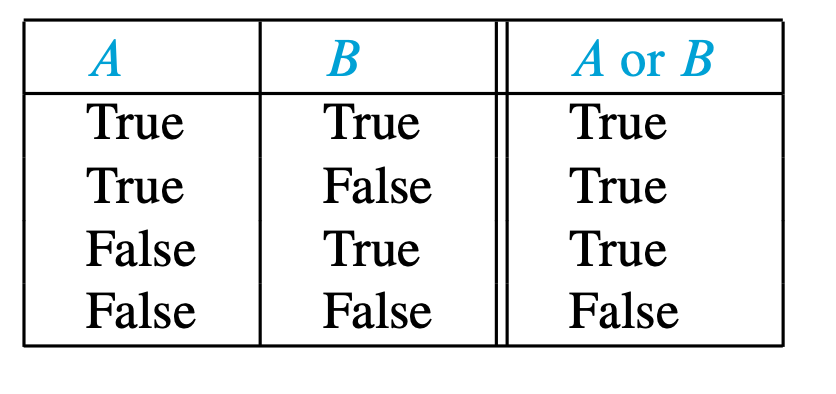

### Notes at 9:48am on January 15th, 2020

## Theorem

A **theorem** is a **declarative statement about mathematics for which there is a proof.**

A **proof** is an **essay that incontrovertibly shows that a statement is true.**

In math, **there are 3 types of declarative statements**

-   **THEOREMS** - statements we know to be true because we can prove them
-   **CONJECTURES** - statements whose truth we cannot ascertain
-   **MISTAKES** - statements that are false

In mathematics the word *true* is meant to be considered absolute, unconditional, and without exception.



- this holds true because we can prove this theorem. However, technically when we draw a triangle, it's not right. But the perfect triangle exists in our mind; the drawing is just a visual aid anyways!
  - Mathematicians have adopted the convention that a statement is called *true* provided it is absolutely true without exception. A statement that is not absolutely true in this strict way is called *false*.

```
“Prime numbers are odd.” Is this statement true? No. The number 2 is prime but not odd. Therefore, the statement is false. The number 2 is an exception but we cannot call it true as a result.
```


## If-then Statements

The vast majority of theorems can be expressed in the form “If A, then B.” For example, the theorem “The sum of two even integers is even” can be rephrased “If x and y are even integers, then x + y is also even.”

The statement “If A, then B” means: Every time condition A is true, condition B must be true as well. Consider the sentence “If x and y are even, then x + y is even.” All this sentence promises is that when x and y are both even, it must also be the case that x + y is even. (The sentence does not rule out the possibility of x + y being even despite x or y not being even. Indeed, if x and y are both odd, we know that x + y is also even.)







---

## If and Only If

```
If an integer x is even, then x + 1 is odd, and if x + 1 is odd, then x is even.
```

- it's verbose, and there are other ways to express it, but it means:
  - A implies B and B implies A --------> this can be expressed concisely as:
    - A if and only if B

Therefore:

```
An integer x is even if and only if x + 1 is odd.
```



The two conditions A and B must be both true or both false.

**Some ways to express "if and only if"**:



## And, Or, and Not

“A and B” means that **both statements A and B are true**



### Or

- we **are allowed the possibility of both, contrary to English**

```
Suppose x and y are integers with the property that x | y and y | x. Then x = y or x = -y.
```

**POSSIBLE OUTCOMES**

-   x = y but not x = -y (e.g., take x = 3 and y = 3)
-   x = -y but not x = y (e.g., take x = -5 and y = 5)
-   x = y *and* x = -y, which is possible only when x = 0 and y = 0



---

```
If an integer is both a perfect square and prime, then it is negative.
```

