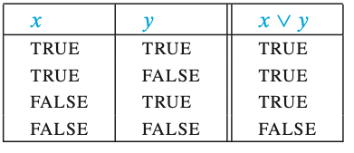
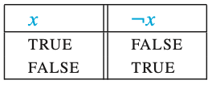
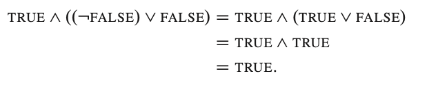
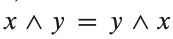
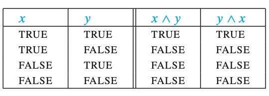
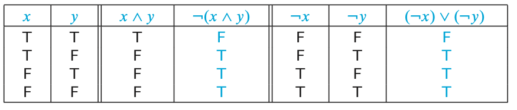

Study Notes at 10:07pm on January 19th, 2021

## Boolean Algebra

Boolean logic can only have two values: **True** and **False**

*and, or, and not* are **the basic operations**

---

### AND


### OR



### NOT



---

### We can use these operators in algebraic expressions



---

### We could try to prove that 



```
(x + y)^2 = x^2 + 2xy + y^2
```

### Obviously it's ridiculous to try to plug in every single possible value for X or Y

So we instead can use boolean values since there are only four possible values



This is a **proof** that


In an example like this, where these two boolean expressions are equal for all possible values of their variables, these expressions are **logically equivalent**. 

---




Since these columns are **exactly the same**, they are **logically equivalent**. It doesn't matter which values we choose for *x and y*.

```
Truth table proof of logical equivalence
To show that two Boolean expressions are logically equivalent:
Construct a truth table showing the values of the two expressions for all possible values of the variables.
Check to see that the two Boolean expressions always have the same value.
```

